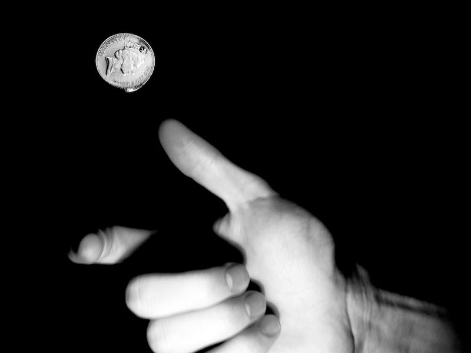
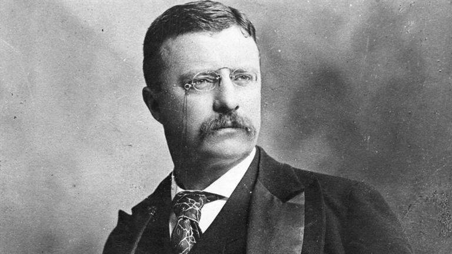
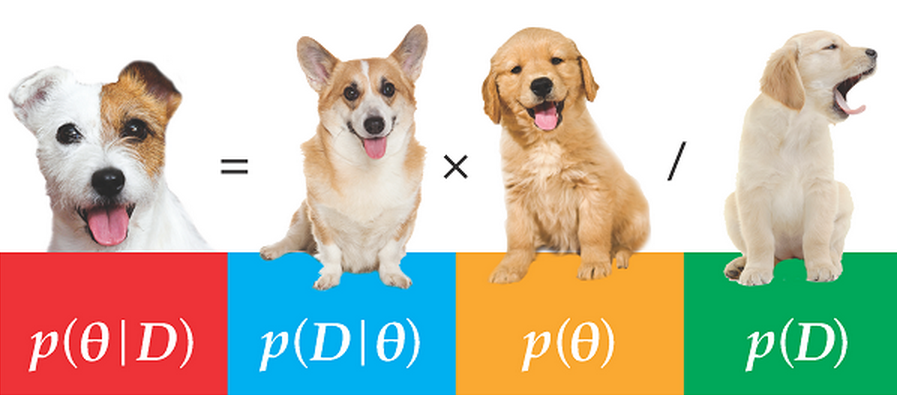

```{r setup, include=FALSE, cache=F, message=F, warning=F, results="hide"}
knitr::opts_chunk$set(cache=TRUE, warning=F, message=F)
knitr::opts_chunk$set(fig.path='figs/',  fig.width=14, fig.height=9)
knitr::opts_chunk$set(cache.path='cache/')

knitr::opts_chunk$set(
                  fig.process = function(x) {
                      x2 = sub('-\\d+([.][a-z]+)$', '\\1', x)
                      if (file.rename(x, x2)) x2 else x
                      }
                  )
```

```{r loaddata, echo=F, eval=T, message=F, warning=F}

library(tidyverse) # for most things
library(stevemisc) # for formatting and r2sd()
library(stevedata) # for ?TV16
library(modelsummary) # for tables
library(kableExtra) # for prettying up tables
  
TV16 %>%
  filter(state == "Pennsylvania" & racef == "White") -> Penn

```

# Introduction
### Goal for Today

*Introduce students to basic Bayesian inference*.

# Frequentist vs. Bayesian Inference
## Frequentist Inference
### "Frequentist" Inference and Research Design

You should be familiar with our discussion of research design and quantitative analysis to this point.

- Concepts, measures, variables, et cetera.
- Research design and the logic of control.
- Random sampling of the population (i.e. inferential statistics).
- Regression (linear or logistic) as estimating cause and effect.

### "Frequentist" Inference and Research Design

We summarize inference as follows.

- If our regression coefficient is at least $\pm$ 1.96 standard errors from zero, we reject the null hypothesis.
- The regression coefficient is "statistically significant" in support of our hypothesis.

We know this because central limit theorem tell us this is true.

### "Statistically Significant" Frequentist Inference

The simplicity of "statistically significant" is powerful and deceptive.

- When *z* = 1.96, we would observe a coefficient that far from zero five times in 100 random samples, on average.

Notice more carefully what's happening.

- We assume a fixed parameter (here: the null).
- We make statements of relative frequencies of extreme results under it.

### "Statistically Significant" Frequentist Inference

Does that really make sense?

- Central limit theorem says it's true.

However, it depends on two things we routinely don't have.

1. Known population parameters
2. Repeated sampling

### Probability and Frequentist Inference



**Objectivist probability** is the foundation for classical statistics.

### Objectivist Probability

For example, the probability of a tossed coin landing heads up is a characteristic of the coin itself.

- By tossing it infinitely and recording the results, we can estimate the probability of a head.

Formally:

$$
	Pr(A) = \lim _{n \to \infty}\frac{m}{n} 
$$

...where:

- *n*: number of trials
- *m*: number of times we observe event *A*
- *A*: outcome in question (here: a coin landing heads up).

### Objectivist Probability and Frequentist Inference

We can understand why classical statistics is **frequentist** and **objectivist**.

- Frequentist: probability is a long-run relative *frequency* of an event.
- Objectivist: probability is a characteristic of the object itself.
	- e.g. cards, dice, coins, roulette wheels.

## Bayesian Inference
### Bayesian Probability

Bayesian probability statements are states of mind about the states of the world and not states of the world, per se.

- It is a *belief* of some event occurring.
- It is characterized as *subjective* probability accordingly.

There are constraints, but nonetheless a substantial amount of variation allowed on probabilistic statements.

### Bayesian Probability: An Unintuitive Application



What is the probability that Teddy Roosevelt is the 25th U.S. President?

### Bayesian Probability

A Bayesian approach:

- What is my degree of belief that statement is true?

A frequentist approach:

- Well, was he or wasn't he?

Since there is only one experiment for this phenomenon, the frequentist probability is either 0 or 1.

- The phenomena is neither standardized nor repeatable.

### Bayesian Probability

Even greater difficulties arise for future events. For example:

- What is the probability of a 9/11-scale terrorist attack in the U.S. in the next five years?
- What is the probability of a war between the U.S. and North Korea?
- What is the probability that Trump peacefully leaves the White House in January?

### Bayesian Inference

These are all perfectly legitimate and interesting questions.

- However, frequentist inference offers no helpful answer.

Bayesian inference does offer a helpful route in **Bayes' theorem**.

### Bayesian Inference

The probability of event *A* given *B* for a continuous space:

$$
	p(A|B) = \frac{p(B|A)p(A)}{p(B)}
$$

With only two possible outcomes: *A* and ~A

$$
	p(A|B) = \frac{p(B|A)p(A)}{p(B|A)p(A) + p(B|\sim A)p(\sim A)}
$$

### Bayesian Inference: An Illustration with Pregnancy Tests

Suppose a woman wants to know if she's pregnant.

- She acquires a name-brand test that purports to be 90% reliable.
	- i.e. if you're pregnant, you'll test positive 90% of the time.
- It gives false positives 50% of the time.
	- i.e. if you're not pregnant, you'll test positive 50% of the time.
- Suppose the probability of getting pregnant after a sexual encounter is *p* = .15
	- *Note*: this is just one number I found. I'm not that kind of doctor.

### Bayesian Inference: An Illustration with Pregnancy Tests

Suppose the woman tested positive.

- She knows her test purports 90% accuracy in testing positive, given she is pregnant.
- *She wants to know if she's pregnant, given she tested positive*.

### Bayesian Inference: An Illustration with Pregnancy Tests

We are interested in *p*(preg | test +). We know the following:

- *p*(test + | preg) = .90
- *p*(preg) = .15 (conversely: *p*(~preg) = .85).
- *p*(test + | ~preg) = .50.

We have this derivation of Bayes' theorem.

$$
	p(\textrm{preg} | \textrm{test +)} = \frac{p(\textrm{test +} | \textrm{preg})p(\textrm{preg})}{p(\textrm{test +} | \textrm{preg})p(\textrm{preg}) + p(\textrm{test +} | \sim\textrm{preg})p(\sim\textrm{preg})}
$$

### Bayesian Inference: An Illustration with Pregnancy Tests

We can now answer *p*(preg | test + ).

$$
	p(\textrm{preg} | \textrm{test +)} = \frac{(.90)(.15)}{(.90)(.15) + (.50)(.85)} = \frac{.135}{.135 + .425} = .241
$$

This is far from the belief you'd get from "90% accuracy" and a single positive test.

### Posterior Probability

However, this quantity is important for Bayesians in its own right: a **posterior probability**.

- It's an updated probability of event *A* (being pregnant) after observing the data *B* (the positive test).
- She has a prior belief of being pregnant (*p* = .15), which is now updated to *p* = .241.

Does this mean the woman is really not pregnant?

### Posterior Probability

She should take the updated posterior probability as "prior information" (i.e. *p*(preg) = .241, and *p*(~preg) = .759) and take another test.

- Assume, again, she tested positive.

$$
	p(\textrm{preg} | \textrm{test +)} = \frac{(.90)(.241)}{(.90)(.241) + (.50)(.759)} = \frac{.216}{.216 + .379} = .363
$$

### Posterior Probability


In other words, keep repeating tests until you’re convinced, but don’t begin agnostic each time.

### Bayesian Inference



Bayesian inference uses this uncontroversial imputation of conditional probability as a foundation for statistical inference.

### Bayesian Inference

We say the posterior distribution (i.e. likelihood of the unknown parameter given the data) is *proportional to* the likelihood of the data multiplied by our prior expectations of it.

$$
	\textrm{Posterior} \propto \textrm{Likelihood} \times \textrm{Prior}
$$

...where $\propto$ means "is proportional to" in symbol form.

### The Benefits of Bayesian Inference

Inference is much less clunky.

- Frequentist: what is probability of data, given some (fixed, unobservable, implausible, always "null") parameter?
- Bayesian: what parameters are plausible, given the data?

Explicitly models/incorporates prior beliefs.

- No effect is truly "null."
- Allows for some novel competitive hypothesis testing (see: Western and Jackman, 1994).
- Acknowledges prior distributions (whereas frequentist likelihood models sweep them under the rug).

Allows for greater flexibility in model summary (posterior distributions).

- No ad hoc standard error corrections/approximations.
- Posterior distribution comes free with the analysis.

Greater appreciation in getting the best estimate of a parameter, with uncertainty.

### The Drawbacks of Bayesian Inference

Bayesian inference is computationally demanding.

- Retort: Supercomputing helps, but this is still true.
- Silver lining: You get more out of the model, and greater insight to potential problems in the model.

Bayesian inference is "subjective" while frequentist inference is "objective."

- Retort: making prior beliefs explicit allows greater clarity/transparency.
- Prior distributions are also implicit in frequentist likelihood models. We just sweep them under the rug.

Prior beliefs are "deck-stacking" in support of a hypothesis.

- Retort: this is why we have sensitivity analyses.
- Again: prior distributions are made explicit.

## Conclusion
### Conclusion

Bayesians highlight how many liberties we can take with our research design if we're not careful.

- Inference is kind of "backward." You're not getting the exact answer to the question you're asking.
- Prior beliefs in frequentist models are implicit and never explicit.
- Inference can be summarized as posterior distributions, given a model of the data.

<!-- # Western and Jackman (1994) -->
<!-- ### Western and Jackman (1994) -->

<!--  -->


<!-- ## Nonstochastic and Weak Data -->
<!-- ### Nonstochastic and Weak Data -->

<!-- Two properties of comparative research violate foundations for frequentist inference. -->

<!-- 1. Nonstochastic data (i.e. non-random DGP) -->
<!-- 2. Weak data -->

<!-- ### Nonstochastic Data -->

<!-- Frequentist inference assumes data are generated by a repeated mechanism like a coin flip (hence: RDGP). -->

<!-- - A sample statistic is just one possible result from a draw of a probability distribution of the population. -->

<!-- ### Nonstochastic Data -->

<!-- However, political scientists can define the sample on the population. Examples: -->

<!-- - OECD countries -->
<!-- - Militarized interstate disputes -->
<!-- - Supreme Court decisions -->

<!-- You know what this is. We called this a **census**. -->

<!-- ### Nonstochastic Data -->

<!-- Frequentist inference is inapplicable to the nonstochastic setting. -->

<!-- - If we took another random draw, we'd get the exact same data. -->
<!-- - "Updating" the data doesn't generate a new random sample. -->
<!-- - Appeals to a "superpopulation" don't help either. -->

<!-- ### Weak Data -->

<!-- This takes on two forms in political science research. -->

<!-- 1. Small *n* -->
<!-- 2. Collinearity -->

<!-- If the population of interest is "advanced industrial societies", our *n* is limited to 15 to 21. -->

<!-- - We run out of degrees of freedom quickly when adding controls. -->

<!-- ### Weak Data -->

<!-- The issue of **multicollinearity** also arises in weak data with small *n*. -->

<!-- - This is when two predictors are so highly correlated that their estimated partial effects are uninformative. -->

<!-- This is relevant to a debate Western and Jackman address: what accounts for the percentage of the work force that is unionized? -->

<!-- - Wallerstein: size of civilian labor force (-). -->
<!-- - Stephens: industrial concentration (+). -->

<!-- ### Weak Data -->


<!-- Problem: both are highly collinear (*r* = -.92). -->

<!-- - In normal regression, one has to be dropped. -->
<!-- - We can still estimate this in Bayesian regression. -->

<!-- ## Analysis -->
<!-- ### Using Prior Information -->

<!--  -->

<!-- ### Using Prior Information -->

<!-- Notice what's happening with our prior information. -->

<!-- - Wallerstein and Stephens agree on the effect of left governments. -->
<!-- - They disagree on the two other variables. -->

<!-- ### Using Uninformative Priors -->

<!-- Table 2 provides posterior distributions with uninformative priors. -->

<!-- - When we do this, we allow the data from the sample to have a larger effect over the ensuing posterior distribution. -->

<!-- ### Using Uninformative Priors -->

<!--  -->

<!-- ### Using Uninformative Priors -->

<!-- We see that the effects of left governments and logged labor force size are significant. -->

<!-- - Prima facie, Wallerstein is right. -->
<!-- - The industrial concentration variable is insignificant. -->

<!-- ### Using Informative Priors -->

<!-- In the interest of brevity, let's focus on just Table 3. -->

<!-- - We are looking at the regression results using both sets of prior information. -->

<!-- ### Using Informative Priors -->

<!--  -->

<!-- ### Interpreting Table 3 -->

<!-- Using Wallerstein's priors: -->

<!-- - Posterior estimates for left-wing governments remain precise. -->
<!-- 	- Actually gain a little precision too. -->
<!-- -  Prior information makes confidence interval for labor-force size much less diffuse. -->
<!-- - No effect of industrial concentration. -->

<!-- ### Interpreting Table 3 -->

<!-- Using Stephens' priors: -->

<!-- - Same posterior estimates for left-wing governments. -->
<!-- - Labor-force size estimate still significant, though magnitude decreases. -->
<!-- - Significant effect of industrial concentration. -->
<!-- 	- But notice: we had prior beliefs about that effect! -->

<!-- The data we ultimately observed don't discount the effect of industrial concentration if you build in the prior belief. -->

<!-- # Conclusion -->
<!-- ### Conclusion -->

<!-- Bayesians highlight how many liberties we can take with our research design if we're not careful. -->

<!-- - A census (a non-random DGP) does not permit conventional statistical inference. -->
<!-- - Collinearity magnifies problems of weak data. -->

<!-- Importantly, why start agnostic of the population parameter if we do not have to do this? -->

<!-- - If you have prior information, use it. -->
