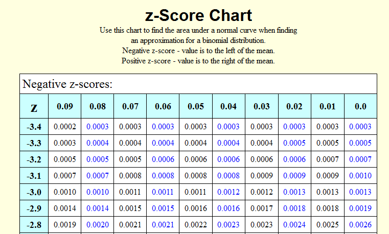

# Introduction
### Goal for Today

*Make inferential claims from a random sample to a population.*

### Introduction

We are moving pretty quickly now into applied statistical inference.

- We discussed random sampling as the foundation of inference.
- This leads to an important trade-off between bias and efficiency.

We can actually calculate this random sampling error.

\begin{equation}
    \textrm{R.S.E.} = \frac{\textrm{Variation component}}{\textrm{Sample size component}}
\end{equation} 

This random sampling error is the standard error of a sample mean.

\begin{equation}
    \textrm{Standard error of sample mean} = \frac{\sigma}{\sqrt{n}}
\end{equation}    

### What's Next?

How likely is the sample statistic given a population parameter?

- What if we assume (or even know) the population parameter?
- How likely is it we observed that sample statistic?

We can answer this question by reference to two concepts.

1. Central limit theorem
2. Normal distribution

# Central Limit Theorem and Normal Distribution
### Central Limit Theorem

The **central limit theorem** says:

- with an infinite number samples of size *n*...
- from a population of *N* units...
- the sample means will be normally distributed.

Corollary findings:

- The mean of sample means would equal $\mu$.
- Random sampling error would equal the standard error of the sample mean ($\frac{\sigma}{\sqrt{n}}$)

### Normal Distribution

A **normal distribution** is a symmetrical, continuous function.

- Its peak is the arithmetic mean ($\mu$).
- Its width equals the variance ($\sigma^2$)

### Normal Distribution

Consider Figure 6-3.

- The author has a hypothetical 20,000-student university.
- He wants to measure a "thermometer" rating of Democrats
- Assume $\mu$ = 58 and $\sigma$ = 24.8.

The author took 100,000 random samples of *n* = 100.

- Contrast Figure 6-3 with Panel A in Figure 6-2.

### Figure 6-3

### Figure 6-2, Panel A

## Standardization
### Standardization

A raw normal distribution is somewhat uninformative.

- **Standardization** will make it useful.

\begin{equation}
    z = \frac{\textrm{Deviation from the mean}}{\textrm{Standard unit}}
\end{equation}

The standard unit will vary, contingent on what you want.

- If you're working with just one random sample, it's the standard deviation.
- If you're comparing sample means across multiple random samples, it's the standard error.

### Standardized Normal Distribution

### Standardization

Larger *z* values indicate greater difference from the mean.

- When *z* = 0, there is no deviation from the mean (obviously).

Standardization allows for a better summary of a normal distribution.

### Figure 6-5

### Standardization and the Normal Distribution

Recall: a normal distribution is symmetrical around the peak ($\mu$)

- Thus, 68% of cases in the distribution: $-1 \le z \le 1$

Notice the mark that extends to *z* = |1.96|

- This interval contains 95% of the cases in the normal distribution.

If we were to randomly pick a sample mean from the distribution, there's a 95% chance it would be within 1.96 standard errors of $\mu$.

## Inference Using the Normal Distribution
### Inference Using the Normal Distribution

What's the next step? Assume this scenario for illustration.

- The students in our university don't know $\mu$.
- We assume they know $\sigma$, a bit unrealistic, but alas...
- They have an *n* of 100 and $\overline{x}$ of 59.

They want to know the location of the population mean.

### Inference Using the Normal Distribution

Our best guess of the population parameter is the sample statistic.

- We have to account for the noise introduced by random sampling.
- However, we'll never truly "know" the population parameter.

A **95-percent confidence interval** can be informative.

- It's the interval in which 95% of all possible sample estimates will fall by chance.
- We operationalize this as $\overline{x} \pm (1.96)$*(standard error).

### Inference Using the Normal Distribution

How we apply this for our problem.

- We have our x-bar.
- We have our *n* and assume a known $\sigma$.
- Standard error = 2.48 ($\frac{\sigma}{\sqrt{n}} = \frac{24.8}{\sqrt{100}} = 2.48$)

We can get our upper/lower bounds of a 95-percent confidence interval.

\begin{equation}
\textrm{Lower bound} =  \overline{x} - (1.96)*(2.48) = 59 - 4.8608 = 54.1392
\end{equation}

\begin{equation}
\textrm{Upper bound} =  \overline{x} + (1.96)*(2.48) = 59 + 4.8608 = 63.8608
\end{equation}

### Inference Using the Normal Distribution

We discuss this interval as follows.

- If we took 100 samples of *n* = 100, 95 of those random samples on average would have sample means between 54.1392 and 63.8608.

We're not saying, for the moment, the true population mean is between those two values. We don't necessarily know that.

- However, even this process gives us some nice properties.

### An Illustration of Inference

Assume the College Democrats president is suspicious of our x-bar.

- (S)he claims it should be higher (say: $\mu$ = 66)

So what can we do about this claim?

### An Illustration of Inference

This is a probabilistic question!

- i.e. What was the probability of $\overline{x}$ = 59 if $\mu$ = 66?

We can answer this by reference to *z* values.

\begin{equation}
z = \frac{\overline{x} - \mu}{s.e.} = \frac{59 - 66}{2.48} = -2.82
\end{equation}

### Find the *z* Value

### An Illustration of Inference

What is the probability that a random sample would produce a *z* value of -2.82?

- Answer: .0024.

In other words: if $\mu$ were 66, we'd observe that $\overline{x}$ only *24 times of 10,000 samples, on average*.

- This is highly improbable.
- We suggest is the College Democrats president is likely wrong in his/her assertion.
- We offer that our sample mean is closer to what $\mu$ really is.

### Some Derivations

We assumed we knew $\sigma$, if not $\mu$. What if we don't know either?

- Use the sample standard deviation (*s*) instead.
- Do the same process with a **Student's t-distribution**.
- This is almost identical to a normal distribution, but with fatter tails for fewer **degrees of freedom**.

Uncertainty increases with fewer degrees of freedom.

### Student's t-distribution

### Some Derivations

What about **sample proportions**?  Let *p* = proportion of cases in one category.

\begin{equation}
\textrm{Standard error of sample proportion} = \frac{\sqrt{p*(1-p)}}{\sqrt{n}}
\end{equation}

From there, do the same process you've done previously with *z* values.

- *Important*: inference is unreliable when *p* is very small (*p* < .05).

# Conclusion
### Conclusion: The Process of Inference

Notice the process of inference.

1. Assume the hypothetical mean to be correct.
2. Test the claim about the hypothetical mean based on a random sample.
3. Infer about the claim of the population mean using probabilistic inference.

We will never know $\mu$, but we know more about $\mu$ by randomly sampling the population and determining what $\mu$ is likely not.