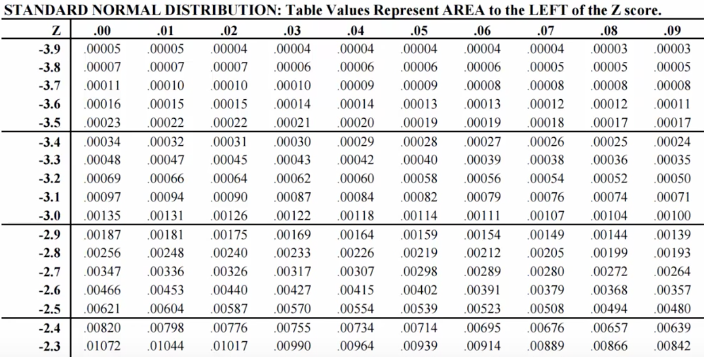
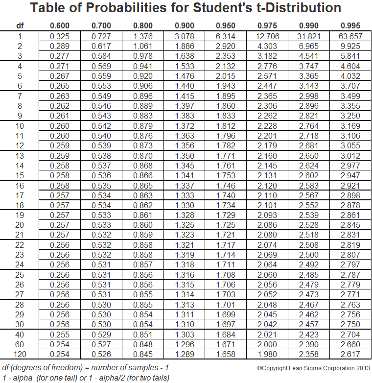

```{r setup, include=FALSE, cache=F, message=F, warning=F, results="hide"}
knitr::opts_chunk$set(cache=TRUE, warning=F, message=F)
knitr::opts_chunk$set(fig.path='figs/')
knitr::opts_chunk$set(cache.path='cache/')

knitr::opts_chunk$set(
                  fig.process = function(x) {
                      x2 = sub('-\\d+([.][a-z]+)$', '\\1', x)
                      if (file.rename(x, x2)) x2 else x
                      }
                  )
```

```{r opts, cache=FALSE, eval=TRUE, echo=FALSE}
library(tidyverse)
library(stevemisc)
library(dqrng)

Population <- rbnorm(250000, mean =42.42, sd = 38.84,
                     lowerbound = 0, 
                     upperbound = 100,
                     round = TRUE,
                     seed = 8675309) # Jenny, I got your number...

```


# Introduction
### Goal for Today

*Make inferential claims from a random sample to a population.*

### Introduction

We are moving pretty quickly now into applied statistical inference.

- We discussed random sampling as the foundation of inference.
- This leads to an important trade-off between bias and efficiency.

We can actually calculate this random sampling error.

\begin{equation}
    \textrm{R.S.E.} = \frac{\textrm{Variation component}}{\textrm{Sample size component}}
\end{equation} 

This random sampling error is the standard error of a sample mean.

\begin{equation}
    \textrm{Standard error of sample mean} = \frac{\sigma}{\sqrt{n}}
\end{equation}    

### What's Next?

How likely is the sample statistic given a population parameter?

1. What if we assume (or even know) the population parameter?
2. How likely is it we observed that sample statistic?

We can answer this question by reference to two concepts.

1. Central limit theorem
2. Normal distribution

# Central Limit Theorem and Normal Distribution
### Central Limit Theorem

The **central limit theorem** says:

- with an infinite number samples of size *n*...
- from a population of *N* units...
- the sample means will be normally distributed.

Corollary findings:

- The mean of sample means would equal $\mu$.
- Random sampling error would equal the standard error of the sample mean ($\frac{\sigma}{\sqrt{n}}$)

### Normal Distribution

A **normal distribution** is a symmetrical, continuous function.

- Its peak is the arithmetic mean ($\mu$).
- Its width equals the variance ($\sigma^2$)

You should remember some other features our lecture on this distribution.


### An Applied Example from a Thermometer Rating

```{r loaddata, echo=F, eval=T, message=F, warning=F}

Therms <- haven::read_dta("~/Dropbox/data/anes/2020-ets/anes_pilot_2020ets_dta.dta") %>%
  select(fttrump1, ftobama1) %>%
  mutate_all(~ifelse(. > 100, NA, .)) %>% 
  haven::zap_labels()

```

Let's use a real-world illustration from the 2020 ANES exploratory testing survey.

- Survey period: April 10-18, 2020 (online).
- Released July 27, 2020

The question is a basic thermometer rating of Donald Trump.

- Scale: 0 ("coldest") to 100 ("warmest")

###

```{r trumptherm, echo=F, eval=T, warning=F, fig.width=14, fig.height=8.5}
trump_mean <- round(mean(Therms$fttrump1, na.rm=T), 2)
trump_median <- round(median(Therms$fttrump1, na.rm=T), 2)
trump_sd <- round(sd(Therms$fttrump1, na.rm=T), 2)

trump_label <- paste0("Mean (solid): ", trump_mean,
                      "\nMedian (dashed): ", trump_median,
                      "\nStandard deviation: ", trump_sd)

Therms %>%
  ggplot(.,aes(fttrump1)) +
  geom_histogram(binwidth = 1, alpha=.6, color="black") +
  theme_steve_web() +
  geom_segment(x=median(Therms$fttrump1, na.rm=T), y=0, xend=median(Therms$fttrump1, na.rm=T), yend=Inf, linetype="dashed") +
  geom_segment(x=mean(Therms$fttrump1, na.rm=T), y=0, xend=mean(Therms$fttrump1, na.rm=T), yend=Inf, linetype="solid") +
  scale_x_continuous(breaks = seq(0, 100, by =10)) +
  annotate(geom="text",x=100, y=700,
           label=trump_label,
           size=3.5, hjust=1,
           vjust=1,
           family="Open Sans") +
  labs(title = "Thermometer Ratings for Donald Trump (ANES ETS, 2020)",
       subtitle = "Thermometer ratings for divisive political figures in the U.S. tend to be ugly as hell with estimates of central tendency that don't faithfully capture the data.",
       x = "Thermometer Scale [0:100]", y = "Number of Observations in Response",
       caption = "Data: American National Election Studies (Exploratory Testing Survey, 2020). N = 3,073.")
```

### Thermometer Rating

This is what you'll get in these questions, by the way.

- 0-100 thermometer ratings are *noisy* with natural "heaping" patterns.
- Partisanship only compounds the problem, as you can probably gather.

Notice the mean and median aren't too far apart, but the data don't look "normal" for obvious reasons.

- Standard deviation is also huge.
- Conventional interpretation: there are more people who loathe Trump than those who really love him.

Next slide: what it looks like for Barack Obama.

### 

```{r obamatherm, echo=F, eval=T, warning=F, fig.width=14, fig.height=8.5}
obama_mean <- round(mean(Therms$ftobama1, na.rm=T), 2)
obama_median <- round(median(Therms$ftobama1, na.rm=T), 2)
obama_sd <- round(sd(Therms$ftobama1, na.rm=T), 2)

obama_label <- paste0("Mean (solid): ", obama_mean,
                      "\nMedian (dashed): ", obama_median,
                      "\nStandard deviation: ", obama_sd)

Therms %>%
  ggplot(.,aes(ftobama1)) +
  geom_histogram(binwidth = 1, alpha=.6, color="black") +
  theme_steve_web() +
  geom_segment(x=median(Therms$ftobama1, na.rm=T), y=0, xend=median(Therms$ftobama1, na.rm=T), yend=Inf, linetype="dashed") +
  geom_segment(x=mean(Therms$ftobama1, na.rm=T), y=0, xend=mean(Therms$ftobama1, na.rm=T), yend=Inf, linetype="solid") +
  scale_x_continuous(breaks = seq(0, 100, by =10)) +
  annotate(geom="text",x=100, y=700,
           label=obama_label,
           size=3.5, hjust=1,
           vjust=1,
           family="Open Sans") +
  labs(title = "Thermometer Ratings for Barack Obama (ANES ETS, 2020)",
       subtitle = "Again: thermometer ratings for divisive political figures in the U.S. tend to be ugly as hell with estimates of central tendency that don't faithfully capture the data.",
       x = "Thermometer Scale [0:100]", y = "Number of Observations in Response",
       caption = "Data: American National Election Studies (Exploratory Testing Survey, 2020). N = 3,072.")
```

### What We'll Do

Let's create a hypothetical "population" with the set parameters from the Trump ratings.

- Data will be bound between 0 and 100 with a mean of 42.42 and standard deviation of 38.84.
- N  = 250,000 (i.e. scaled down from U.S. adult population of ~250 million).

We want to approximate the "population" mean thermometer rating via central limit theorem.

- We'll grab a million samples of ten respondents and store the sample means.

Let's plot the results.

### R Code

```r
# rbnorm from stevemisc
Population <- rbnorm(250000, mean =42.42, sd = 38.84,
                     lowerbound = 0, 
                     upperbound = 100,
                     round = TRUE,
                     seed = 8675309) # Jenny, I got your number...
```

Note: it's hard to perfectly mimic these kind of thermometer ratings from a simple distribution, but this will do.

- Mean: `r mean(Population)`
- Standard deviation: `r sd(Population)`

### R Code

```{r sampmil, echo=T, eval=T, cache=TRUE}
set.seed(8675309) # Jenny, I got your number...
# Note dqrng offers much faster sampling at scale
Popsamples <- tibble(
  samplemean=sapply(1:1000000, 
           function(i){ x <- mean(
             dqsample(Population, 10, 
                    replace = FALSE)) 
           })) 
```

###

```{r plotsampmil, echo=F, eval=T, fig.width=14, fig.height=8.5}
Popsamples %>%
  ggplot(.,aes(samplemean)) + geom_histogram(binwidth=.5,aes(y=..density..),alpha=0.7) +
  theme_steve_web() + 
  geom_vline(xintercept = mean(Population), linetype="dashed") +
  stat_function(fun=dnorm,
                color="#522d80", size=1.5,
                args=list(mean=mean(Popsamples$samplemean), 
                          sd=sd(Popsamples$samplemean))) +
  labs(x = "Sample Mean", y = "Density",
       title = "The Distribution of 1,000,000 Sample Means, Each of Size 10",
       subtitle = "Notice the distribution is normal and the mean of sample means converges on the known population mean (vertical line).",
       caption = "Data: Simulated data for a population of 250,000 where mean = 42.42 and standard deviation = 38.84.")

```

### How Did We Do?

See for yourself:

```{r compare}
mean(Popsamples$samplemean)
mean(Population)

```

Not bad...


### Implications of Central Limit Theorem

Remember the previous implications of random sampling error?

- i.e. a good-sized sample reduces random sampling error in even high-variation data?


###

```{r sampleftobama, echo=F, eval=T,  fig.width=14, fig.height=8.5}
sample_sizes <- c(10, 25, 100, 400, 1000, 2000, 4000, 10000)

Samps = list() 
set.seed(8675309)
for (j in sample_sizes) {
   Samps[[paste0("Sample size: ", j)]] = data.frame(sampsize=j, samp=sapply(1:10, function(i){ x <- sample(Population, j, replace = FALSE) }))
}

Samps %>%
  map_df(as_tibble) %>%
  gather(samp, value, samp.1:samp.10) -> Samps

Samps %>%
  group_by(sampsize, samp) %>%
  summarize(sampmean = mean(value)) %>%
  ggplot(., aes(as.factor(sampsize),sampmean)) + 
  geom_point(size=3, color="black", alpha=0.5) +
  theme_steve_web() + 
  geom_hline(yintercept = mean(Population), linetype="dashed") +
  labs(x = "Sample Size",
       y = "Sample Means",
       title = "Ten Sample Means of Varying Sample Sizes from a Population",
       subtitle = "The diminishing returns of increasing sample size emerge around 1,000 observations, even as the spread in these simulated data is quite large.",
       caption = "Data: Simulated data for a population of 250,000 where mean = 42.42 and standard deviation = 38.84.")

```

### Implications of Central Limit Theorem

Likewise, infinite samples of *any* size (even absurdly small samples of high-variation data) reduce the gap between estimate and "true" population parameter.

## Standardization
### Standardization

A raw normal distribution I presented is somewhat uninformative.

- **Standardization** will make it useful.

\begin{equation}
    z = \frac{\textrm{Deviation from the mean}}{\textrm{Standard unit}}
\end{equation}

The standard unit will vary, contingent on what you want.

- If you're working with just one random sample, it's the standard deviation.
- If you're comparing sample means across multiple random samples, it's the standard error.


### Standardization

Larger *z* values indicate greater difference from the mean.

- When *z* = 0, there is no deviation from the mean (obviously).

Standardization allows for a better summary of a normal distribution.

###


```{r ggplotshade, echo=F, eval=T, fig.width=14, fig.height=8.5}
normal_dist("#522d80","#F66733", "Open Sans") + 
  theme_steve_web() +
  # ^ all from stevemisc
    labs(title = "The Area Underneath a Normal Distribution",
       subtitle = "The tails extend to infinity and are asymptote to zero, but the full domain sums to 1. 95% of all possible values are within about 1.96 standard units from the mean.",
       y = "Density",
       x = "")
```

###

```{r plotsampmilz, echo=F, eval=T,  fig.width=14, fig.height=8.5}
Popsamples %>%
  mutate(z = (samplemean-mean(samplemean))/sd(samplemean)) %>%
  ggplot(.,aes(z)) + geom_histogram(binwidth=.15,aes(y=..density..),alpha=0.7) +
  theme_steve_web() + 
  geom_vline(xintercept = 0, linetype="dashed") +
  stat_function(fun=dnorm,
                color="#522d80", size=1.5) +
  labs(x = "Sample Mean (Standardized)", y = "Density",
       title = "The Distribution of 1,000,000 Sample Means, Each of Size 10",
       subtitle = "Notice the distribution is normal and the mean of sample means converges on the known population mean (vertical line).",
       caption = "Data: Simulated data for a population of 250,000 where mean = 42.42 and standard deviation = 38.84.\nHistograms are admittedly a bit clunky here because the choice of bin width may be misleading, but this is at least honest.")

```


<!--
### Standardization and the Normal Distribution

Recall: a normal distribution is symmetrical around the peak ($\mu$)

- Thus, 68% of cases in the distribution: $-1 \le z \le 1$

Notice the mark that extends to *z* = |1.96|

- This interval contains 95% of the cases in the normal distribution.

If we were to randomly pick a sample mean from the distribution, there's a 95% chance it would be within 1.96 standard errors of $\mu$.
-->

## Inference Using the Normal Distribution
### Inference Using the Normal Distribution

What's the next step? Assume this scenario for illustration.

- We as researchers have a sample of 100 people from this population.

```{r oursample, cache=T, eval=T, echo=T}
set.seed(8675309)
oursample <- sample(Population, 100, replace = FALSE)
mean(oursample)
```

- We as researchers don't know $\mu$ (though it's `r round(mean(Population), 2)`).
- We assume we know $\sigma$ (`r round(sd(Population), 2)`), a bit unrealistic, but alas...
- We have an *n* of 100 and $\overline{x}$ of `r round(mean(oursample), 2)`.

We want to know the location of the population mean.

### Inference Using the Normal Distribution

Our best guess of the population parameter from the sample is the sample statistic.

- We have to account for the noise introduced by random sampling.
- However, we'll never truly "know" the population parameter.

A **95-percent confidence interval** can be informative.

- It's the interval in which 95% of all possible sample estimates will fall by chance.
- We operationalize this as $\overline{x} \pm (1.96)$*(standard error).

### Inference Using the Normal Distribution

How we apply this for our problem.

- We have our x-bar.
- We have our *n* and assume a known $\sigma$.
- Standard error = `r round(sd(Population)/sqrt(length(oursample)), 3)` ($\frac{\sigma}{\sqrt{n}} = \frac{38.88}{\sqrt{100}} = 3.88$)

### Inference Using the Normal Distribution

We can get our upper/lower bounds of a 95-percent confidence interval.

\begin{equation}
\textrm{Lower bound} =  \overline{x} - (1.96)*(s.e.)
\end{equation}


\begin{equation}
\textrm{Upper bound} =  \overline{x} + (1.96)*(s.e.)
\end{equation}

### R Code

```{r}
#computation of the standard error of the mean
sem<-sd(Population)/sqrt(length(oursample))
#95% confidence intervals of the mean
c(mean(oursample)-1.96*sem, mean(oursample)+1.96*sem)

```

### Inference Using the Normal Distribution

We discuss this interval as follows.

- If we took 100 samples of *n* = 100, 95 of those random samples on average would have sample means between `r round(mean(oursample)-1.96*sem, 2)` and `r round(mean(oursample)+1.96*sem, 2)`.

We're not saying, for the moment, the true population mean is between those two values. We don't necessarily know that.

- However, even this process gives us some nice properties.

### An Illustration of Inference

Assume we have a Pickens County resident who is suspicious of our *x*-bar.

- (S)he claims it has to be much higher. Say: 56.61.
    - Rationale: this is the percentage of the vote Trump got in the Pike precinct of Pickens County.
    - In other words, (s)he is basically inferring by anecdote or making hasty generalizations from his/her surroundings.

So what can we do about this claim?

### An Illustration of Inference

This is a probabilistic question!

- i.e. What was the probability of $\overline{x}$ = `r round(mean(oursample), 2)` if $\mu$ = 56.61?

We can answer this by reference to *z* values.

\begin{equation}
z = \frac{\overline{x} - \mu}{s.e.}
\end{equation}

### R Code

```{r getourz}
(mean(oursample)-56.61)/sem
```

### Find the *z* Value



### ...or in R

```{r orinr}
1-pnorm(abs((mean(oursample)-56.61)/sem))
```

### An Illustration of Inference

What is the probability that a random sample would produce a *z* value of `r round((mean(oursample)-56.61)/sem, 4)`?

- Answer: `r sprintf("%.5f",round(1-pnorm(abs((mean(oursample)-56.61)/sem)), 5))`

In other words: if $\mu$ were 56.61, we'd observe that $\overline{x}$ only about `r round((1-pnorm(abs((mean(oursample)-56.61)/sem)))*10000, 0)` times in 10,000 trials, on average.

- This is highly improbable.

### An Illustration of Inference

What do we conclude?

- We suggest this hypothetical Pickens County resident is likely wrong in his/her assertion.
- We offer that our sample mean is closer to what $\mu$ really is.

Since we've been playing god this whole time, we know that's true.

### What About the Known Population Mean?

How likely was our $\overline{x}$ of `r round(mean(oursample), 2)` given the $\mu$ of `r round(mean(Population), 2)`? Same process.

```{r sameprocess}
(mean(oursample)-mean(Population))/sem
1-pnorm(abs((mean(oursample)-mean(Population))/sem))
```

The probability of our sample mean, given the population mean (that we know), is `r round(1-pnorm(abs((mean(oursample)-mean(Population))/sem)), 2)`.

- This is a likely outcome.
- We cannot rule out the population mean from our random sample like we could with the hypothetical mean of 56.61.

### Some Derivations

We assumed we knew $\sigma$, if not $\mu$. What if we don't know either?

- Use the sample standard deviation (*s*) instead.
- Do the same process with a **Student's t-distribution**.
- This is almost identical to a normal distribution, but with fatter tails for fewer **degrees of freedom**.
    - Degrees of freedom = n - k (i.e. number of observations - number of parameters [here: 1])

Uncertainty increases with fewer degrees of freedom.

### Student's t-distribution



### Some Derivations

What about **sample proportions**?  Let *p* = proportion of cases in one category.

\begin{equation}
\textrm{Standard error of sample proportion} = \frac{\sqrt{p*(1-p)}}{\sqrt{n}}
\end{equation}

From there, do the same process you've done previously with *z* values.

- *Important*: inference is unreliable when *p* is very small (*p* < .05).

# Conclusion
### Conclusion: The Process of Inference

Notice the process of inference.

1. Assume the hypothetical mean to be correct.
2. Test the claim about the hypothetical mean based on a random sample.
3. Infer about the claim of the population mean using probabilistic inference.

We will never know $\mu$, but we know more about $\mu$ by randomly sampling the population and determining what $\mu$ is likely not.