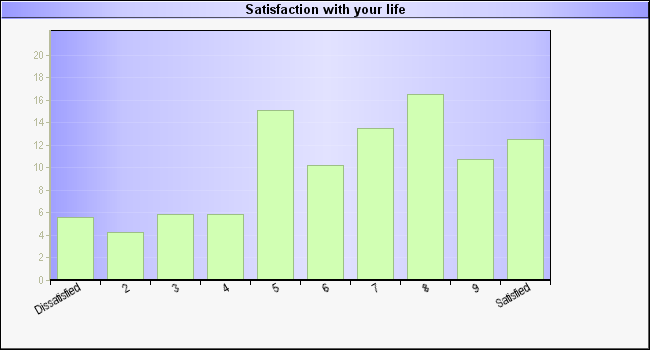
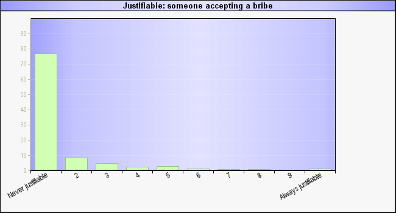

# Introduction
### Goal for Today

*Discuss the definition and measurement of variables.*

### Introduction

The previous lecture discussed that we start with a broader concept that interests us.

- e.g. "political tolerance", "war", or "state development"

However, proceeding with political *science* requires a tangible measure of the concept in question.

- Measurement really is the heart of science.

Once we have that measure, we have, in essence, a **variable**.

# On Variables
### Variables

What is a **variable**?

- It is the empirical measurement of a characteristic.
- It's also a numeric array of data that has at least two separate values.

### Dummy Variables

A variable with just two values is called a **dummy variable**.

- Some type of phenomenon is either present or absent.
- Typically coded as 1 or 0, respectively.

Gender is the most common and intuitive dummy variables.

- We typically code women as 1, men as 0.

We don't try to explain variations in gender (seriously, don't), but gender may explain phenomena of interest.

- e.g. support for parental leave policies in Europe, support for contraceptive coverage in the U.S.

## Levels of Measurement
### Levels of Measurement

There are three levels of precision in a variable.

1. Nominal
2. Ordinal
3. Interval

### Nominal Variables

A **nominal variable** has the lowest level of precision.

- This is also called a "categorical variable".

The numeric values in these variables code differences *and nothing else*.

### Nominal Variables

What does this mean? Take our gender example.

- i.e. women = 1 and men = 0.
- We need to substitute these numeric values for labels in order to do any statistical analysis.

Numerically, we know 1 > 0.

- That does not mean we are saying that women are "better" than men.

We are not saying that 1 > 0, but that 1 != (i.e. does not equal) 0.

- All binary variables are, by design, nominal variables.

### Nominal Variables

There are other examples of nominal variables with plenty of different values. Examples:

- State of origin (e.g. Alabama, Alaska, Arizona...)
- Race (e.g. white, black, etc...)
- Religion (e.g. Protestant, Catholic, Muslim, etc...)
- Party affiliation (e.g. Democrat, Republican, Independent, etc...)

Again, values in these variables simply code differences.

### Ordinal Variables

**Ordinal variables** capture rank, or order, within the numeric values.

- They often (but do not always) look like Likert items.

Likert items make a statement and prompt a level of agreement with the statement.

- e.g. "People who sell cannabis should always be prosecuted"
	- Actual question from British Social Attitudes Survey
- Answers: Strongly agree, agree, neutral, disagree, strongly disagree.
- Corresponding values: 2, 1, 0, -1, -2.

### Ordinal Variables

Since the variable captures degree of agreement, we can say that 2>1 and 1>-2.

- People who respond "agree" are more in agreement with the statement than those who "strongly disagree".
- However, this variable does not precisely say much.

An ordinal variable captures order and rank, but only captures *relative* difference.

### Interval Variables

An **interval variable** captures *exact* differences.

- It's our most precise level of measurement.

Perhaps the most common interval measure we observe is age in years.

- i.e. someone who is 34 is 13 years older than someone who is 21.
- Notice the difference is no longer relative, but exact and precise.

Age is an easy way of thinking of interval variables, but we have others too.

- Political economy researchers have a glut of interval variables.
- e.g. gross national income, GDP per capita, kilowatt hours consumed per capita, consumer price index.

### Is It Ordinal or Interval?

The difference between ordinal and interval is mostly intuitive, but there is a gray area sometimes.

- Do we know if a guy who earns $50,001 is exactly one dollar richer than a guy who makes $50k even?
	- We may have an issue of cents.
- Is the person who is 21 exactly one year older than a 20-year-old?
	- We may have an issue of days and months.

How would you know when it's ordinal or interval?

### A Rule of Thumb

We love to treat technically ordinal variables as interval when we can.

- Especially true for age and income.

We asks ourselves two questions.

1. How many different values are there?
2. How are the data distributed?

### A Rule of Thumb

If it has seven or more different values, you can *start* to think of it as interval.

- e.g. life satisfaction on a 10-point scale.
- e.g. justifiability of bribe-taking on a 10-point scale.

However, check to see how the data are distributed.

- Is it bimodal? Is there a noticeable skew?
- If so, *don't* treat it as interval.

We'll be using two examples from the 2000 wave of World Values Survey.

### You Can Think of This as Interval

### *Don't* Treat This as Interval

### Condensing Interval to Nominal

You can always condense a measure to lower levels of precision, but cannot add levels of precision. Take income, for example.

- **Interval**: income in dollars
- **Ordinal**: 0-$25k, $25k-$50k, $50k-$75k, $75k-$100k, $100k and above
- **Nominal**: low income earners (i.e. < $25k) and now low income earners.

# Conclusion
### Conclusion

This lecture focused on describing variables by their precision.

- Variables are nominal, ordinal, or interval.
- We have intuitive means to classify them.

Correctly classifying them is important.

- This will condition our choice of tools for descriptive and inferential statistics.
