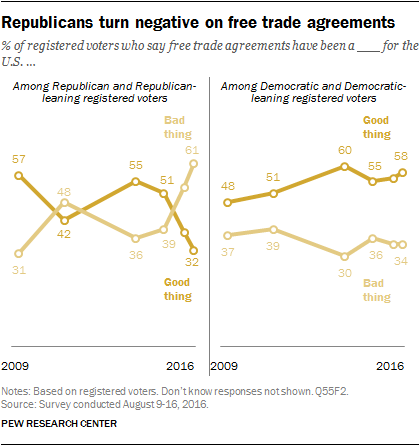
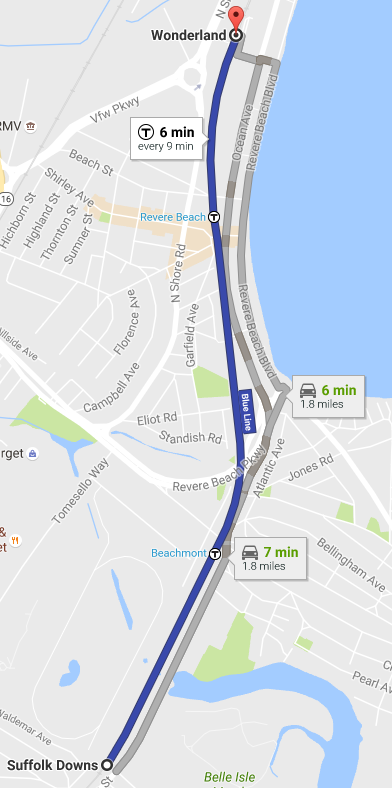
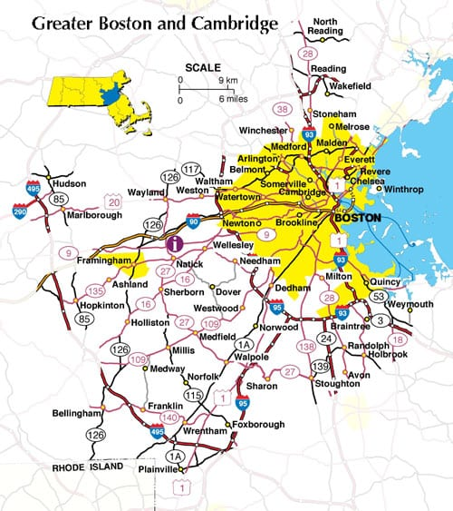

# Introduction
### Goals for Today

1. *Belabor a model-based approach to science*.
2. *Discuss hypothetico-deductivism and falsificationism*.
3. *Connect "model" as "map"*.
4. *Discuss the EITM approach to improving shortcomings in standing political science methods*.

### Zaller's Example

John Zaller (1992) has one of the most influential models of mass public opinion.

1. *Reception*: citizens who engage with an issue are more likely to receive a political message.
2. *Resistance*: people resist arguments that are inconsistent with their predispositions.
3. *Accessibility*: recent considerations are more accessible than older considerations.
4. *Response*: opinion comes from averaging across easily accessible considerations.

We call this the "Receive-Accept-Sample" model.

### An Example of this Model in Operation

### Zaller's Approach, (i.e. EITM)

> The method of the book, then, is to develop the deductive implications of the four basic axioms for a given, highly specific set of conditions; review evidence indicating whether or not these implications are empirically correct; and present new evidence as necessary and possible to resolve outstanding empirical questions (Zaller 1992, 51).

# A Model-based Approach
## H-D and Falsificationism
### Hypothetico-Deductivism (H-D)

Kyburg (1988, 65) outlined the H-D model

- A hypothesis *H* is set up for testing or examination.
- We deduce an observation sentence *O* from *H* and its necessary qualifiers, boundary conditions, etc.
- We test *H* with an experiment or examination and observe either *O* or ~*O*.

If ~*O*, then ~*H*. If *O*, we fail to refute *H*.

### Hypothetico-Deductivism (H-D)

Replace *H* with theory *T* and we have the standard political science model (Hausman 1992, 304).

1. *Formulate* some hypothesis *H* from theory *T*.
2. *Deduce* prediction *P* from *H* with necessary qualifiers (e.g. "ceteris paribus").
3. *Test* *P*.
4. *Judge* whether *H* is confirmed or disconfirmed, contingent on *P* or ~*P*.

### Falsificationism

"Falsificationism" is a philosophy to science that aims for demarcation.

- i.e. what distinguishes science (e.g. astronomy) from non-science (e.g. astrology).

Also concerned with the problem of induction (see: Hume).

- Major emphasis: nothing can be learned from a confirming instance.
- Requires the future to be exactly like the past.
- The logic is also circular: induction is used to justify induction.

### Problems with Our Understanding of H-D

We adequately understand the theory is a "model".

- It leaves out certain things in order to simplify a complex world.

However, the "facts" *don't* speak for themselves!

- Notice how little we said about "how" to tell whether *P* is true or false.
- The statistical tools we use rest on their own assumptions.

We don't test theories with data; *we test them with models of data*.

- These too are imperfect.

## Science as Model, Simplification
### Science as Model, Simplification

Truism in political science: "all models are wrong; some are useful".

- What exactly does this mean?

###

From Lewis Carroll's "The Bellman's Map".

> "That's another thing we've learned from your Nation," said Mein Herr, "map-making. But we've carried it much further than you. What do you consider the largest map that would be really useful?"
>
> "About six inches to the mile."
>
> ""Only six inches!" exclaimed Mein Herr. "We very soon got to six yards to the mile. Then we tried a hundred yards to the mile. And then came the grandest idea of all! We actually made a map of the country, on the scale of a mile to the mile!"
> 
>"Have you used it much?" I enquired.
>
> "It has never been spread out, yet," said Mein Herr: "the farmers objected: they said it would cover the whole country, and shut out the sunlight! So we now use the country itself, as its own map, and I assure you it does nearly as well.

### 

### 

### 

### 

### Map as Model; Model as Map

1. A map is an object, and thus neither true nor false.
2. Maps have limited accuracy.
3. Maps are partial.

*Maps are ultimately purpose relative*.

- It's designed to be similar enough to the real world and to be used for a specific purpose.

We should evaluate our models/theories based on the purpose they intend to serve.

<!-- ### Prominent Political Science Examples

1. Krehbiel (1998) "pivotal politics model".

- Bargaining takes place over single policy proposal by median voter of the Senate.
- It can be blocked by filibuster, presidential veto, or both. -->

## Empirical Implications of Theoretical Models (EITM)
### Empirical Implications of Theoretical Models (EITM)

EITM is shorthand for this approach, and a push across political science.

1. Start with theory, informed by case study, field work, or "puzzle".
2. Outline model establishing causal linkages.
3. Stipulate deductions and hypotheses.
4. Outline measurement and research design to test deductions.
5. Collect and analyze data.

The results are inductively compared to the theory and its hypotheses.

### Common Shortcomings in Applied Political Science

There are generally three camps to inference in political science.

1. Abstract theoretical modeling
2. Case studies
3. "Garbage can" regressions

### Respect the Facts

Theoretical modelers can wed themselves too much to the modus tollens of the H-D framework.

- Recall: if A, then B. Therefore, if A, then B.

Simplification in pursuit of an abstract model can make the model too unrealistic to be useful in the real world.

### Theorizing by Proverb

Case studies can be illuminating, but empirical tests can be inadequate.

- Inferences are often inductive.
- Inferences are built on observations that informed the theory.
- Single case studies are low-power analyses.

Case studies help us address the problem of "unrealism" in theoretical models.

- However, we strive for generalization.
- We also strive to rule out rival explanations.

### "Garbage Cans" and the Abuse of Statistics

Quantitative modelers have their own list of sins too.

- "Garbage cans" and saturated models.
- The search for "significance" in absence of prediction.
- "Data mining"/reanalysis of standing analyses.
- Use of complex methods without understanding the assumptions.

Quantitative analyses routinely forget their statistical model is in fact a statistical *model*.

- It works only when the assumptions are met.
- It too is built on the principle of simplification.

# Conclusion
### Conclusion

EITM is shorthand for the common approach to political science.

1. Start with theory, derive hypotheses.
2. Outline model establishing link between "cause" and "effect"
3. Stipulate hypotheses to test.
4. Outline measurement and research design.
5. Collect and analyze data.

### Conclusion

This approach should unify politcal science approaches.

1. Encourage formal modelers to "respect the facts"
2. Discourage case study researchers from "theorizing by proverb".
3. Curtail need to do "garbage can" regression without theoretical justification.