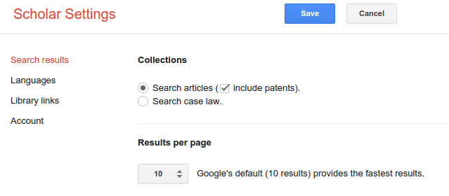
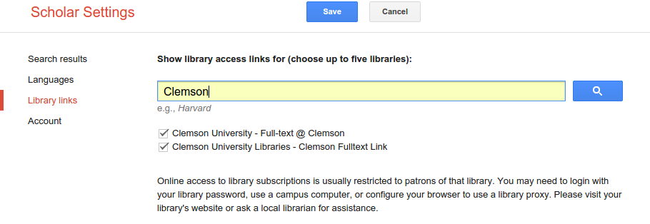
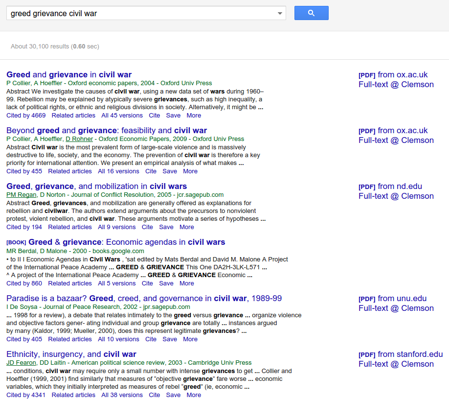
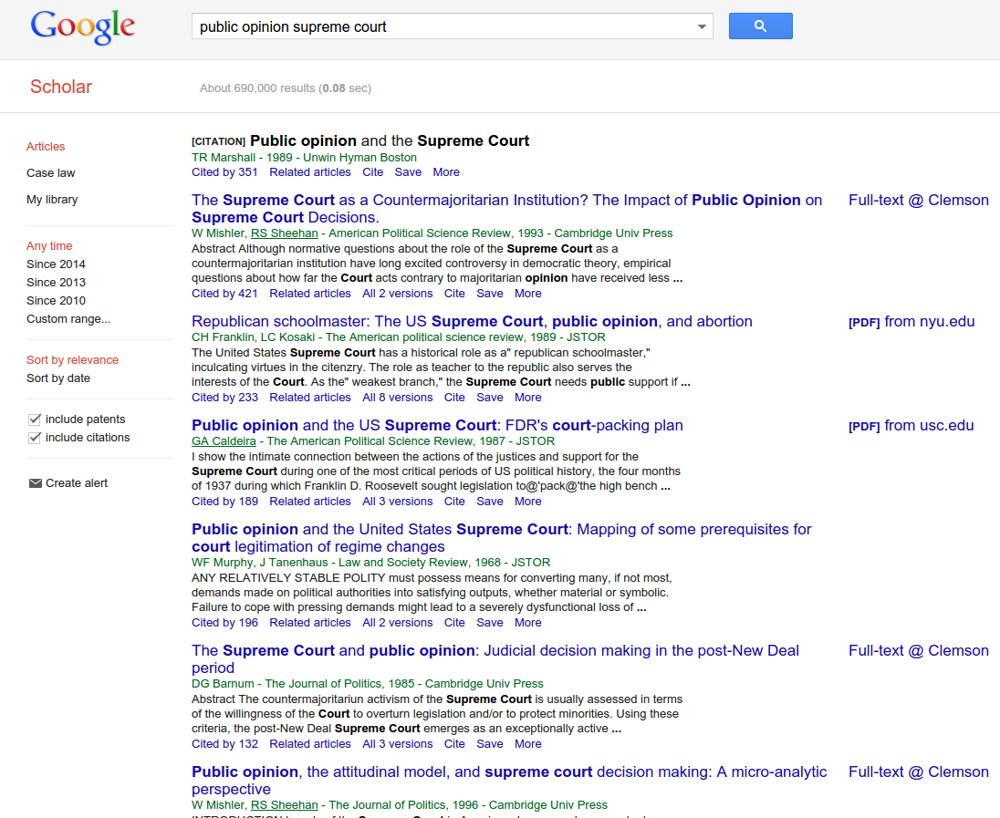

# Introduction
### Goal for Today

*Discuss how to organize and write a literature review.*

### The Problem

Your professor wants an "original paper" due at the end of the semester.

- S/he doesn't want a summary paper of things you've read.
- S/he wants some kind of original analysis.

What does it mean to provide an "original paper"?

- It means your professor doesn’t want you duplicating what someone else did.

In order to advance an original analysis, you need to review what others have done on your topic and how what you want to do is novel and new.

- This the **literature review**.

### The Problem

The literature review is tedious for professors to read/write in their own
work, but it's important for a student assignment they grade.

- You must communicate to your professor as early as you can that you know what you're doing.

How we typically go about doing this:

- Professors are experienced and know the material well.
- Grad students have some intermediate training.
- Undergrads have neither the experience nor much of the training.

This lecture will try to help.

# Obtaining Sources
### Obtaining Sources

There are two places you should look for material.

1. The syllabus
2. Google Scholar

## Undergrad Syllabi
### Undergrad Syllabi

Syllabi for undergrad courses aren't great resources, but they are a place to start.

- Compare/contrast a grad syllabus with an undergrad syllabus for the same course.

Undergrad syllabi: less readings overall, more emphasis on textbooks.

- Textbooks aren't really helpful, nor are they original analyses.
- Do follow the citations in the textbook, though.

### Start with the Syllabus

The syllabus is still the best place to start.

- Your professors writes the syllabus to introduce the student to the field.
- They constitute what the professors believes to be the most important works.

**Hint**: it's also a signal from the professor about what s/he believes the student will have evaluated in writing the end-of-the-semester paper.

- You should also do the readings...

## Google Scholar
### "Google It"

"Googling it" is the next most obvious thing to do.

- Don't use regular Google. Use Google Scholar.

### The Benefits of Google Scholar

There are multiple benefits of Google Scholar

- Can search *inside* many books and articles.
    - Your library search relies on keywords, which is not as helpful.
- Search results are presented more intuitively.
- Search results also gather more, and more relevant, items of interest.

Best of all, Google Scholar links to your university library.

###

### 

### 

### Searching for Sources in Google Scholar

Let's assume I'm writing a paper on why citizens rebel against the government.

- If you were paying attention in a civil war class, we'd call this "civil war onset".
- I know from the syllabus about different motivations of anti-government rebels.

In other words, are rebels motivated mostly by legitimate grievances or by opportunities to accumulate wealth?

- This is the **greed vs. grievance debate**.

My job is to write a paper that can address part of this debate.

### Searching for Sources in Google Scholar

I will start by searching for *rebel group motivation* on Google Scholar.

- I'll search *greed grievance civil war* next.

### 

### 

### Searching for Sources in Google Scholar

New question: what relationship exists between public opinion and Supreme Court voting?

- I don't know this material like I do civil wars.
- Let's search *public opinion supreme court* to see what comes up.

###

### Making the Most of Google Scholar

Some tips:

- Search results are ordered by relevance (by default).
    - Select "sort by date" if you want the other alternative.
    - Better yet: set a custom range of the past 20 years or so to the present.
- Google Scholar can find if someone has made the article freely available.
- "Cited by" gives an indicator of how influential the argument is.
- Google Scholar also lists the journal. Some are higher-profile than others.

## What Counts as a Good Source?
### What Counts as a "Good Source"?

Professors are interested in scholarship, not journalism or advocacy.

- I'm not going to accept a literature review based off *New York Times* or *Wall Street Journal*.
- At best, these illustrate current events or some statistics to be explained.

Your professor wants to know you've read and evaluated scholarly books and articles.

### Evaluating Book Sources

Books are great sources, but should not be the exclusive source type.

- Citing a textbook is generally a bad look.
- General rule: quality of book is correlated with marquee name of university press.
- There are also several good commercial publishers.
- Check the book's citation count in Google Scholar.

### Good Book Publishers

Cambridge, Harvard, and Oxford are generally the best book publishers.

- Next best: Chicago, Cornell, Michigan, Princeton, Stanford, and Yale.

There are several good commercial publishers as well.

- e.g. CQ Press, CRC Press, Longman, Norton, Pearson, Prentice Hall, Rowman and Littlefield, Routledge, Sage, Springer, and Wiley.

### Evaluating Article Sources

*Articles should be the modal search result, and in your bibliography too.*

### General Interest Political Science Journals

- American Political Science Review
- American Journal of Political Science
- Journal of Politics
- British Journal of Political Science
- Political Research Quarterly
- Social Science Quarterly
- Annual Review of Political Science
- PS: Political Science & Politics
- Political Science Research & Methods
- Polity

*Check my website for other journal sources. It's in my "how to do a literature review" document*.

- We generally call these "field journals".

### Gathering the Sources You Need

Some final tips.

1. Your literature review should be light on sources more than 20-years-old.
    - Some citations are to "core" or "classic" material, but you'll need newer stuff as well.
2. Think of a "literature review of a literature reviews" approach.
    - i.e. find the newest, most original analysis.
    - Read the article, but focus on the literature review.
    - Track down and read those sources mentioned in the literature review.
    - Find the sources mentioned in *those* literature reviews. Repeat.
    
# Writing the Literature Review
## What Is (and Isn't) a Literature Review
### What the Literature Review Isn't

*Don't lose track of the literature review's purpose:* summarize scholarship on a topic of interest.

- I don't care that you read a bunch of stuff.
- Don't treat it like an annotated bibliography.
- Don't list arguments disconnected from a bigger point.
- Don't advance your argument.
    - That comes next in the paper.
    
### What the Literature Review Is

At a minimum, the literature review must answer these questions:

1. What's the puzzle or problem to be solved?
2. What do we know already?
3. What do we *not* know?
4. Why is all this important?

Your literature review ultimately justifies your paper by identifying what others have done and indicates how you'll add to it.

## Frames for a Literature Review
### Framing a Literature Review

There's no one right way to do a literature review.

- It kinda depends on your question/puzzle.

Some common frames follow:

1. Why is A the case and not B?
2. We know a lot about A, but not about B.
3. A and B disagree about C. Who is right?

### Why is A the Case and not B?

I see this a lot in political theory and IR theory. Examples:

- Louis Hartz: why are there no competing ideologies to Locke in the U.S.?
- J.L. Gaddis: why didn't the U.S. and USSR fight each other?

If not done right, this does carry a normative tone.

- Focus more on what is and not what ought to be.

### We Know About A, but not About B

I use this one a lot. I call it the "gap in the literature" frame.

- Alternatively: "unaddressed question", or "the next step".

Be careful with this frame.

- Lots of boring questions go "unaddressed".
- Political scientists tend to cringe at the phrase "filling a gap in the literature".

Emphasize the substantive importance if this is the frame.

- i.e. construction workers fill gaps; academics try to solve problems.

### A and B Disagree About C. Who is Right?

This is the "competitive hypothesis" or "horse race" frame.

- Pit competing explanations against each other and see who's right.

The "attack" frame is derivative of this.

- i.e. A's explanation for C is incorrect.
- Be careful with this: *critique*, don't "attack".
    - Science is about improving what others have done before you.
    
# Conclusion
### Conclusion

Howard Becker (1986, 141-2) illustrates the literature review's purpose.

- i.e. don't build a table from scratch. Re-assemble what others have done into something new.

You will master this in time, but learn from reading and emulating.

- Read. Write. Edit. Repeat.