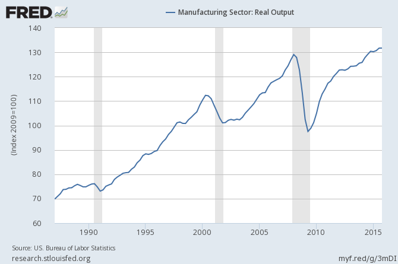
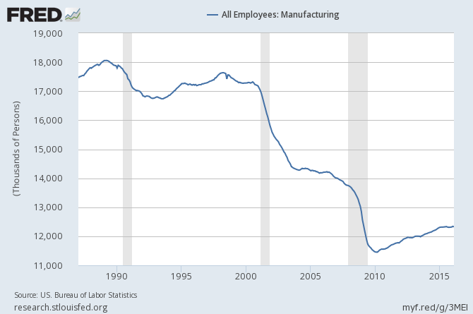
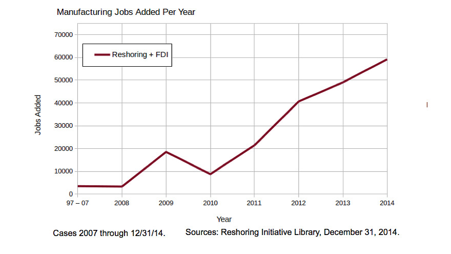

```{r setup, include=FALSE}
knitr::opts_chunk$set(cache=TRUE)
library(car)
library(arm)
library(blme)
library(foreign)
library(ggplot2)
library(stargazer)
# Data <- read.csv("~/Dropbox/teaching/posc3410/post-estimation-simulation/gss14vote.csv", na.strings=c(".a",".d",".i",".n"))
Data <- read.csv("~/Dropbox/data/anes/2016-pilot/anes_pilot_2016.csv")
ANES2012 <- read.dta("~/Dropbox/data/anes/2012/anes_timeseries_2012_stata12.dta", convert.factors = FALSE)

Data$oppfreetrade <- with(Data, recode(freetrade, "1:4=0;5:7=1"))
Data$greatoppfreetrade <- with(Data, recode(freetrade, "1:6=0;7=1"))
Data$supfreetrade <- with(Data, recode(freetrade, "1:3=1; 4:7=0"))
Data$msupfreetrade <- with(Data, recode(freetrade, "1:2=1; 3:7=0"))
Data$greatsupfreetrade <- with(Data, recode(freetrade, "1=1; 2:7=0"))

Data$age <- 2016 - Data$birthyr
Data$z.age <- arm::rescale(Data$age)
Data$female <- with(Data, recode(gender,"1=0;2=1"))
Data$race4 <- with(Data, recode(race, "1=1;2=2;3=3;4:8=4"))
Data$collegeed <- with(Data, recode(educ, "0:4=0; 5:6=1"))
Data$nohsed <- with(Data, recode(educ, "1=1; 2:6=0"))
Data$hsedorless <- with(Data, recode(educ, "1:2=1; 3:6=0"))
Data$z.educ <- arm::rescale(Data$educ)


Data$unemployed <- with(Data, recode(employ, "1:3=0;4=1;5:9=0"))
Data$income <- with(Data, recode(faminc, "31:98=NA"))
Data$z.income <- arm::rescale(Data$income)


Data$partyid <- with(Data, recode(pid7, "8=NA"))
Data$z.partyid <- arm::rescale(Data$partyid)
Data$rep <- with(Data, recode(pid3, "1=0; 2=1; 3:4=0; 5=NA"))
Data$dem <- with(Data, recode(pid3, "1=1; 2:4=0; 5=NA"))
Data$ind <- with(Data, recode(pid3, "1:2=0; 3:4=1; 5=NA"))
Data$strongrep <- with(Data, recode(pid7, "1:6=0; 7=1; 8=NA"))
Data$strongdem <- with(Data, recode(pid7, "1=1; 2:7=0; 8=NA"))

Data$ideology <- with(Data, recode(ideo5, "6=NA"))
Data$z.ideology <- arm::rescale(Data$ideology)
Data$vlib <- with(Data, recode(ideo5, "1=1; 2:5=0; 6=NA"))
Data$vcon <- with(Data,recode(ideo5, "1:4=0; 5=1; 6=NA"))


# M3 <- bglmer(msupfreetrade ~ z.age + female + hsedorless + unemployed + factor(race4) +
#             (1 + hsedorless | partyid),
#            data=Data, family=binomial(link="logit"))

ggCaterpillar <- function(re, QQ=TRUE, likeDotplot=TRUE, reorder=TRUE) {
require(ggplot2)
f <- function(x) {
pv   <- attr(x, "postVar")
cols <- 1:(dim(pv)[1])
se   <- unlist(lapply(cols, function(i) sqrt(pv[i, i, ])))
if (reorder) {
  ord  <- unlist(lapply(x, order)) + rep((0:(ncol(x) - 1)) * nrow(x), each=nrow(x))
  pDf  <- data.frame(y=unlist(x)[ord],
                     ci=1.645*se[ord],
                     nQQ=rep(qnorm(ppoints(nrow(x))), ncol(x)),
                     ID=factor(rep(rownames(x), ncol(x))[ord], levels=rownames(x)[ord]),
                     ind=gl(ncol(x), nrow(x), labels=names(x)))
} else {
  pDf  <- data.frame(y=unlist(x),
                     ci=1.645*se,
                     nQQ=rep(qnorm(ppoints(nrow(x))), ncol(x)),
                     ID=factor(rep(rownames(x), ncol(x)), levels=rownames(x)),
                     ind=gl(ncol(x), nrow(x), labels=names(x)))
}

if(QQ) {  ## normal QQ-plot
  p <- ggplot(pDf, aes(nQQ, y))
  p <- p + facet_wrap(~ ind, scales="free")
  p <- p + xlab("Standard normal quantiles") + ylab("Random effect quantiles")
} else {  ## caterpillar dotplot
  p <- ggplot(pDf, aes(ID, y)) + coord_flip()
  if(likeDotplot) {  ## imitate dotplot() -> same scales for random effects
    p <- p + facet_wrap(~ ind)
  } else {           ## different scales for random effects
    p <- p + facet_grid(ind ~ ., scales="free_y")
  }
  p <- p + xlab("Levels of the Random Effect") + ylab("Random Effect")
}

p <- p + theme(legend.position="none")
p <- p + geom_hline(yintercept=0)
p <- p + geom_errorbar(aes(ymin=y-ci, ymax=y+ci), width=0, colour="black")
p <- p + geom_point(aes(size=1.2), colour="blue") 
return(p)
}

  lapply(re, f)
}


Data <- with(Data, data.frame(freetrade, oppfreetrade, greatoppfreetrade, supfreetrade,
                              msupfreetrade, greatsupfreetrade, age, z.age, female,
                              race4, educ, collegeed, nohsed, hsedorless, z.educ,
                              unemployed, income, z.income, partyid, z.partyid, rep,
                              dem, ind, strongrep, strongdem, ideology, z.ideology,
                              vlib, vcon))

write.table(Data,file="anes2016-free-trade-sample.csv",sep=",",row.names=F,na="")


```


### Goal for Today

*Explore public opinions about free trade.*

# An Analysis of Attitudes toward Free Trade
### What Do Citizens Think About Free Trade?


## The Ongoing Free Trade Debate
### The Ongoing Free Trade Debate

Free trade is an integral part of U.S. economic policy.

- Important origins in post-WWII international economic order.
- Promoted through BWIs like the ITO during Cold War.
- Post Cold War: NAFTA, WTO

Free trade is one area of consensus among Republican and Democrat elites.

### Arguments for Free Trade

Political scientists/economists tend to agree on free trade too.

- Free trade promotes world peace
- Free trade breaks down cultural barriers
- Free trade promotes economic development in developing world
- Free trade increases total production and efficiency
- Free trade leads to competition and innovation

I'd be hard-pressed to find the political economist or economist that does not support free trade in theory or practice.

### Arguments Against Free Trade

- Free trade increases offshoring/outsourcing
- Free trade depresses wages
- Free trade only benefits the wealthy within wealthy countries
- Free trade makes capital "too mobile"
- Developing countries may artificially depress wages (e.g. China)

Free trade, like any policy, creates winners and losers.

- Those who lose want to revise free trade policy/agreements.

### Is This an Honest Debate?

Political scientists/economists bemoan that this debate kind of misses the point.

- Drezner: most of the criticism rests on an image that's at least ten years out of date.

### Manufacturing Output in the U.S.



### Manufacturing Jobs in the U.S.



### What About China?

China is a special case for negative externalities of free trade in the U.S.

- Enormous size
- Low income/wages
- Government promotion of esports
- Purposely depressed exchange rate

### China Today

However, this is changing.

- China's trade level has flatlined
- Its growth has slowed
- Wages have skyrocketed
- Its currency is now *over*valued

### Free Market = Moving Target

Treat it for what it is: a market

- Those who moved early into China/India/Mexico found the best workers.
- Those who could relocate already have.

### The Emergence of "Reshoring"



### Perception != Reality

```{r echo=FALSE, warning=FALSE, fig.cap=" Do you favor/oppose placing new limits on imports? (ANES 2012)"}
ANES2012$limitimports <- with(ANES2012, recode(imports_limit, "-9:-2=NA; 1=1; 2=0"))
limitimports <- as.factor(ANES2012$limitimports)

ggplot(ANES2012, aes(x=limitimports)) + 
  geom_bar(width=.5) +
  scale_x_continuous(name="", breaks=c(0,1), labels=c("Oppose", "Favor")) +
  scale_y_continuous(name="")

```

## An Argument about Education
### Advancing an Explanation

I propose a simple explanation for variation in support for free trade: education

- Less educated citizens are most vulnerable to globalization.
- The benefits of free trade typically aren't taught in high school.

This makes sense anecdotally:

- Trump: "I love the poorly educated"
- Sanders' support seems to come from "millennials".

### A Possible Interaction?

This might be contingent on partisanship. Anecdotally:

- Democrats championed free trade and Republicans don't question it.
- Sanders is nominally still an "independent"
- Trump brings in "Reagan Democrat" and "first-time voters" [which is a bit misleading, but alas].

### Hypotheses

#### Hypothesis 1

Higher levels of education = more support for free trade

#### Hypothesis 2

Less educated citizens with less affinity to GOP/Dems = more likely to oppose free trade

## Research Design
### Research Design

I gathered data from the 2016 pilot study for ANES.

- n = 1,200
- Respondents from across the country, including territories.

**DV**: Do you favor or oppose the U.S. making free trade agreements with other countries?

- Seven-point scale [favor a great deal:oppose a great deal]
- I condense it to a binary measure: 
    - 1 = favor a great deal/moderately favor
    - 0 = favor a little:oppose a great deal
    
I'm sure this could be done better, but this is for illustration.

### Research Design

**IVs**:

- Age (in years)
- Sex (female)
- Race (fixed effects [white, black, hispanic, other])
- Education (high school education or less)
- Unemployed
- Party ID (strong GOP, strong Dem)

**Model**:

- logistic regression

Code is available in this powerpoint/on my Github

## Results
### Results

\footnotesize

```{r eval=FALSE}

summary(M1 <- glm(msupfreetrade ~ z.age + female + factor(race4) + 
                    hsedorless + unemployed + 
            strongrep + strongdem,
          data=Data, family=binomial(link="logit")))


summary(M2 <- glm(msupfreetrade ~ z.age + female + factor(race4) + 
                    hsedorless + unemployed + 
            strongrep + strongdem + 
              hsedorless:strongrep + hsedorless:strongdem,
          data=Data, family=binomial(link="logit")))
```

\normalsize

### Results

```{r echo=FALSE, results="asis"}
M1 <- glm(msupfreetrade ~ z.age + female + factor(race4) + 
                    hsedorless + unemployed + 
            strongrep + strongdem,
          data=Data, family=binomial(link="logit"))

M2 <- glm(msupfreetrade ~ z.age + female + factor(race4) + 
                    hsedorless + unemployed + 
            strongrep + strongdem + 
              hsedorless:strongrep + hsedorless:strongdem,
          data=Data, family=binomial(link="logit"))

stargazer(M1, M2, header=FALSE, font.size="footnotesize", style="ajps",
          title="Attitudes About Free Trade (ANES, 2016)",
          omit.stat=c("ll","aic"),
          model.names= FALSE, dep.var.labels.include = FALSE,
          covariate.labels=c("Age", "Female", "Race=Black", "Race=Hispanic", "Race=Other",
                             "HS ed or less", "Unemployed", "Strong GOP", "Strong Dem",
                             "HS ed or less*Strong GOP", "HS ed or less*Strong Dem"),
          single.row=TRUE
          )


```

### Interpretation of Results

- Women are less likely to support free trade than men
- Black respondents are more likely to support free trade than white respondents
- Strong Republicans/Democrats support free trade more than those in between both ends.

### Interpretation of Results

Let's look at the strong Republicans:

- Effect of strong affinity w/ GOP = increase of .524 in natural logged odds of supporting free trade.
- Odds ratio: exp(.524) = 1.688
- Percentage change in odds: 100*(exp(.524) - 1) = 68.87%

### Interpretation of Results

Model 2 tests for a possible interaction.

- Strong Dem no longer significant
    - Actually effect of Strong Dems with more than HS education
- Strong GOP (with HS education or more) still significant

*Effect of HS education or less is significant among those w/o strongest affinity to either party.*

### A Visualization

```{r echo=FALSE, results="asis", warning=FALSE}

M3 <- bglmer(msupfreetrade ~ z.age + female + hsedorless + unemployed + factor(race4) +
             (1 + hsedorless | partyid),
            data=Data, family=binomial(link="logit"))

ggCaterpillar(ranef(M3,condVar=TRUE), QQ=FALSE, likeDotplot=TRUE, reorder=FALSE)[["partyid"]] 


```

# Conclusion
### Conclusion 

Free trade is an ongoing policy debate.

- Political scientists/economists support it.
- It's a rare consensus among Democrat/Republican elites.
- However, a large part of the general public isn't sold on free trade's benefits.

I offer an example logistic regression that hints at why.

- Strong GOP/Dems still support free trade.
- Lower education = less support for those in between both ends.