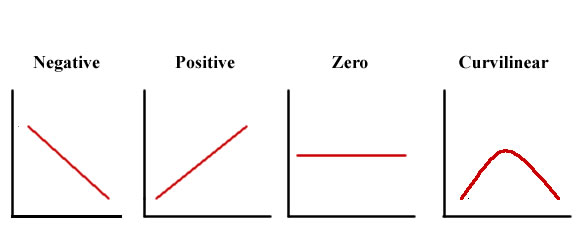
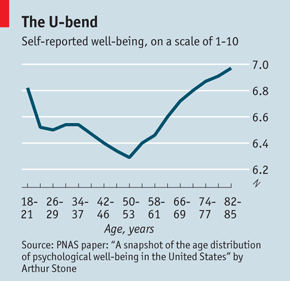

```{r setup, include=FALSE, cache=F, message=F, warning=F, results="hide"}
knitr::opts_chunk$set(cache=TRUE, message=F, warning=FALSE)
knitr::opts_chunk$set(fig.path='figs/')
knitr::opts_chunk$set(cache.path='cache/')

knitr::opts_chunk$set(
                  fig.process = function(x) {
                      x2 = sub('-\\d+([.][a-z]+)$', '\\1', x)
                      if (file.rename(x, x2)) x2 else x
                      }
                  )
```

```{r loadpackages, include=FALSE, cache=FALSE}
library(tidyverse)
library(stevemisc)
library(qs)
library(knitr)
library(kableExtra)

GSS <- qread("/home/steve/Dropbox/data/gss/GSS_spss-2018/gss7218.qs")
USA7 <- haven::read_sav("/home/steve/Dropbox/data/wvs/F00010330-WVS_Wave_7__USA_Spss_v20200720.sav")
```

# Introduction
### Goal for Today

*Introduce students to basic making of comparisons between an independent variable and dependent variable.*

### Theories and Hypotheses

We previously discussed the importance of theory-writing.

- Theories are conceptual, representing your ideas and arguments.
	- It’s the hardest part of political science, but the most important.

Some general things to consider:

- "Keep it Kosher"
- Speak conceptually. Test operationally.
- Don't fit theory to data.

We also discussed proper construction of hypotheses (i.e. testable statements).

# Making Comparisons
### Making Comparisons

This lecture will instruct on how to make comparisons among your independent variable and dependent variable.

- Consider this a kind of "first cut" of inferential statistics.
- A lot of peer-reviewed scholarship begins with the following tools.

We will begin to see if there is a preliminary association between our independent variable and dependent variable.

## Cross-tabulation
### Cross-tabulation

A **cross-tabulation** has three rules in its presentation.

1. Independent variable is the column. Dependent variable is the row.
2. *Always* calculate percentages for the *independent* variable.
3. Interpret a cross-tab by comparing columns across the *same* value of the dependent variable.

### Gun Control Opinions, by Partisanship

We'll start with the gun control question from the book.

- DV: "Would you favor or oppose a law which would require a person to obtain a police permit before he or she could buy a gun?"
- IV: Partisanship (7-point scale, condensed to Ds, Is, and Rs)

Data come from 2018 wave of GSS data.

### R Code

\scriptsize

```{r}
# require(tidyverse)
# require(stevemisc)
# require(qs)
# GSS <- qread("/home/steve/Dropbox/data/gss/GSS_spss-2018/gss7218.qs")

GSS %>% filter(year == 2018) %>% select(partyid, gunlaw) %>%
  mutate(pidcat = case_when(
    between(partyid, 0, 2) ~ "Democrat/Lean Democrat",
    partyid == 3 ~ "Independent",
    between(partyid, 4,6) ~ "Republican/Lean Republican"
  ),
  gunlaw = ifelse(gunlaw == 2, 0, 1)) -> gunlaw18

proptable <- with(gunlaw18, prop.table(table(gunlaw,pidcat), 2))
proptable <- rbind(proptable, c(1, 1, 1))


```

\normalsize

###

```{r crosstab, eval=T, echo=F, results="asis"}

proptable %>% tbl_df() %>%
  rownames_to_column() %>%
  mutate(rowname = c("Oppose", "Favor", "TOTAL")) %>%
  mutate_if(is.numeric, ~paste0(round(.*100, 2), "%")) %>%
  kable(., format="latex",
        caption = "A Crosstab on Support for Gun Control, by Partisanship (GSS, 2018)",
        col.names = c("","Democrat/Lean Democrat", "Independent", "Republican/Lean Republican"),
        align = c("l","c","c","c"),
        booktabs = TRUE, longtable = TRUE) %>%
  row_spec(3, italic=TRUE) %>%
  row_spec(0, bold=TRUE) %>%
  kable_styling(font_size = 9)

```

### Intolerance Toward LGBTQIA+, by Age

Next example will explore social intolerance toward gay people as a function of age/generation.

- DV: "On this list are various groups of people. Could you please mention any that you would not like to have as neighbors?: (Homosexuals)"
    - Group was either mentioned or not mentioned.
- IV: Generation, as defined by Pew cutoffs

Data come from 7th wave (2017) of WVS data (United States).

### R Code

\tiny

```{r ct2, eval=T, include=TRUE, cache=TRUE}
# USA7 <- haven::read_sav("/home/steve/Dropbox/data/wvs/F00010330-WVS_Wave_7__USA_Spss_v20200720.sav")

USA7 %>% rename_all(tolower) %>%
  mutate(age = q262,
         birthyr = q261,
         bornhere = q263,
         homelanguage = q272,
         raceethnic = q290,
         neighb_lang = ifelse(q26 == 1, 1, 0),
         neighb_lgbt = ifelse(q22 == 1, 1, 0),
         neighb_immig = ifelse(q21 == 1, 1, 0),
         neighb_race = ifelse(q19 == 1, 1, 0),) %>%
  select(age:ncol(.)) %>%
  mutate(agecat = carr(age, "18:29=1; 30:49=2; 50:100=3")) %>%
  filter(bornhere == 1 & raceethnic == 840001 & homelanguage == 1240) %>%
  haven::zap_labels() %>%
  mutate(generation = case_when(
    birthyr <= 1945 ~ "Greatest/Silent",
    between(birthyr, 1946, 1964) ~ "Boomers",
    between(birthyr, 1965, 1980) ~ "Gen X",
    between(birthyr, 1981, 1996) ~ "Millennials",
    birthyr >= 1997 ~ "Gen Z"
  )) %>%
  arrange(birthyr) %>%
  mutate(generation = forcats::fct_inorder(generation)) -> neighb17

proptable <- with(neighb17, prop.table(table(neighb_lgbt,generation), 2))
proptable <- rbind(proptable, c(1))


```

\normalsize

### 

```{r panderct2, eval=T, echo=FALSE}

proptable %>% tbl_df() %>%
  rownames_to_column() %>%
  mutate(rowname = c("Not Mentioned", "Mentioned", "TOTAL")) %>%
  mutate_if(is.numeric, ~paste0(round(.*100, 2), "%")) %>%
  kable(., format="latex",
        caption = "Intolerance Toward LGBTQIA+ People, by Generation (WVS, 2017)",
        col.names = c("","Greatest/Silent", "Boomers", "Gen X",
                      "Millennials", "Gen Z"),
        align = c("l","c","c","c","c", "c","c"),
        booktabs = TRUE, longtable = TRUE) %>%
  row_spec(3, italic=TRUE) %>%
  row_spec(0, bold=TRUE)
```

## Mean Comparisons
### Mean Comparisons

When our dependent variable is interval, we can use a **mean comparison table**.

- It shows the mean of a dependent variable for different values of the independent variable.

### Democratic Governance, by Ideology

Next example will explore attitudes about democracy in U.S. as a function of partisan identification

- DV: "And how democratically is this country being governed today? Again using a scale from 1 to 10, where 1 means that it is “not at all democratic” and 10 means that it is “completely democratic,” what position would you choose?"
- IV: whether respondent is a Democrat, Republican, or something else.

Data again come from 7th wave (2017) of WVS data (United States).

### R Code

\tiny

```{r mct1, include=TRUE, cache=TRUE, warning=F, eval=T}

USA7 %>% rename_all(tolower) %>%
  haven::zap_labels() %>%
  mutate(howdem = q251) %>%
  mutate(partycat = dplyr::case_when(
           q223 == "5" ~ "Independent/Other",
           q223 == "840001" ~ "Republican",
           q223 == "840002" ~ "Democrat",
           q223 == "840004" ~ "Independent/Other",
           q223 == "840006" ~ "Independent/Other")) %>%
  select(howdem:ncol(.)) %>%
  arrange(partycat) %>%
  mutate(partycat = fct_inorder(partycat)) %>%
  filter(!is.na(partycat)) -> howdem17

howdem17 %>%
  group_by(partycat) %>%
  summarize(mean = mean(howdem, na.rm=T), 
            n = n()) -> mct


howdem17 %>%
  summarize(mean = mean(howdem, na.rm=T), 
            n = n())  %>%
  mutate(partycat = "TOTAL") %>%
  bind_rows(mct, .) -> mct


```

\normalsize


### 

```{r pandermct1, eval=T, echo=F}
mct %>%
  mutate(mean = round(mean, 2)) %>%
  kable(., format="latex",
        caption = "How Democratically is the U.S. Governed, by Party ID (WVS, 2017)",
        col.names = c("","Mean", "Number of Observations"),
        align = c("l","c","c"),
        booktabs = TRUE, longtable = TRUE) %>%
  row_spec(4, italic=TRUE) %>%
  row_spec(0, bold=TRUE)  %>%
  kable_styling(font_size = 9)
```

## Graphing Relationships
### Bar Charts and Line Charts

Graphically displaying data will help us make comparisons.

- Both communicate percentages or means of a dependent variable, for each value of an independent variable.
- Differ in representation (bars or markers connected by lines).

In each case, the independent variable is the *x*-axis. Dependent variable is the *y*-axis.

### Types of Relationships

There are four types of relationships

1. Positive
2. Negative
3. Curvilinear
4. Zero

### Types of Relationships

Note: curvilinear may also be a "normal-U"




### R Code

\scriptsize

```{r examexample, eval=TRUE, echo=TRUE}

set.seed(8675309)

tibble(b0 = 60,
       b1 = 15,
       n = 100,
       hours = rpois(n, 3),
       score = b0 + b1*(hours^(1/2)) + rnorm(n, 0, 1)) -> examscores

```

\normalsize

###

```{r examgraphlm, eval=TRUE, echo=FALSE,  fig.width=14, fig.height=8.5, warning=F, message=F}
examscores %>%
  ggplot(.,aes(hours, score)) + 
  geom_point() +
  theme_steve_web() +
  geom_smooth(method="lm") +
  scale_x_continuous(breaks = c(0, 1, 2, 3, 4, 5, 6, 7)) +
  labs(title = "The Relationship Between Hours Studied and Exam Score (Linear Fit)",
       subtitle = "Notice a curvilinear relationship of a kind in the data, for which a straight line is not a good fit.",
       caption = "Data: Hypothetical, inspired by Pollock (2012).")
```

###

```{r examgraphloess, eval=TRUE, echo=FALSE}
examscores %>%
  ggplot(.,aes(hours, score)) + 
  geom_point() +
  theme_steve_web() +
  geom_smooth(method="loess") +
  scale_x_continuous(breaks = c(0, 1, 2, 3, 4, 5, 6, 7)) +
  labs(title = "The Relationship Between Hours Studied and Exam Score (Smooth Fit)",
       subtitle = "There are multiple relationships that cannot be meaningfully summarized by one straight line of best fit.",
       caption = "Data: Hypothetical, inspired by Pollock (2012).")

```

### Another Example

Your book has a peculiar example of social disconnectedness and age.

- DV: sum of ordinal measures of time spent with relatives, neighbors, and friends.
   - Ranges from 3 to 21.
   - Higher values = more "disconnectedness"
   - Basically: a 21 means respondent **never** spends any time whatsoever with relatives, neighbors or friends.
- IV: Age in years.

Data come from 2018 wave of GSS.

### R Code

\scriptsize

```{r socialdiscon, eval=F, echo=TRUE}

GSS %>%
  filter(year == 2018) %>%
  select(year, age, socrel, socommun, socfrend) %>%
  mutate(discon = socrel + socommun + socfrend) %>%
  ggplot(.,aes(age, discon)) + geom_smooth(method = "loess")


```

###

```{r socialgraph, eval=TRUE, echo=FALSE,  fig.width=14, fig.height=8.5, warning=F, message=F}
GSS %>%
  filter(year == 2018) %>%
  select(year, age, socrel, socommun, socfrend) %>%
  mutate(discon = socrel + socommun + socfrend) %>%
  ggplot(.,aes(age, discon)) + geom_smooth(method = "loess") +
  theme_steve_web() +
  scale_x_continuous(breaks = c(20, 30, 40,50,60,70,80, 90)) +
  labs(title = "The Relationship Between Age and Social Disconnectedness",
       subtitle = "Younger people are less likely to be socially disconnected. Plateaus emerge for the peak working age and declines for the elderly.",
       caption = "Data: General Social Survey, 2018")
```


### Another Example

Voter turnout by partisanship

- DV: whether respondent voted in 2016 presidential election
- IV: partisanship on the familiar seven-point scale

Data come from 2018 wave of GSS.


###  R Code

\scriptsize

```{r turnout, eval=F, echo=T}

GSS %>% select(year, vote16, partyid) %>%
  filter(year == 2018 & partyid != 7) %>%
  mutate(partycat = case_when(
    partyid == 0 ~ "Strong D",
    partyid == 1 ~ "Not Strong D",
    partyid == 2 ~ "Ind., Lean D",
    partyid == 3 ~ "Ind.",
    partyid == 4 ~ "Ind., Lean R",
    partyid == 5 ~ "Not Strong R",
    partyid == 6 ~ "Strong R"
  ),
  vote16 = ifelse(vote16 == 2, 0, 1)) %>%
  haven::zap_labels() %>%
  arrange(partyid) %>%
  mutate(partycat = fct_inorder(partycat)) %>%
  group_by(partycat) %>%
  summarize(mean = mean(vote16, na.rm=T)) 

```

###

```{r turnoutgraph, eval=TRUE, echo=F,  fig.width=14, fig.height=8.5, warning=F, message=F}
GSS %>% select(year, vote16, partyid) %>%
  filter(year == 2018 & partyid != 7) %>%
  mutate(partycat = case_when(
    partyid == 0 ~ "Strong D",
    partyid == 1 ~ "Not Strong D",
    partyid == 2 ~ "Ind., Lean D",
    partyid == 3 ~ "Ind.",
    partyid == 4 ~ "Ind., Lean R",
    partyid == 5 ~ "Not Strong R",
    partyid == 6 ~ "Strong R"
  ),
  vote16 = ifelse(vote16 == 2, 0, 1)) %>%
  haven::zap_labels() %>%
  arrange(partyid) %>%
  mutate(partycat = fct_inorder(partycat)) %>%
  group_by(partycat) %>%
  summarize(mean = mean(vote16, na.rm=T),
            lab = paste0(mround2(mean),"%")) %>%
  ggplot(.,aes(partycat, mean, fill=partycat)) + 
  geom_bar(stat="identity", color="black") +
  theme_steve_web() +
  scale_fill_manual(values = c("#2166ac", "#67a9cf", "#d1e5f0",
"#f7f7f7", "#fddbc7", "#ef8a62", "#b2182b")) +
  geom_text(aes(label=lab), vjust=-.5, colour="black",
            position=position_dodge(.9), size=4, family = "Open Sans") +
  scale_y_continuous(labels = scales::percent) +
  labs(fill = "", x ="", y="Percentage of People Saying They Voted in 2016",
       title = "The Relationship Between Party Identification and Voting in the 2016 Presidential Election",
       subtitle = "Stronger partisan attachments have long coincided with an increased likelihood of voting, even as the distribution looks like a V.",
       caption = "Data: General Social Survey, 2018.")
```

### 



### R Code

```{r union, echo=T, eval=F}
GSS %>%
  select(year, union, rincom06) %>%
  filter(between(year, 2006, 2014)) %>%
  mutate(union = carr(union, "1=1;2:3=NA; 4=0")) %>%
  group_by(rincom06) %>%
  summarize(mean = mean(union, na.rm=T))
  

```

###

```{r uniongraph, eval=TRUE, echo=FALSE,  fig.width=14, fig.height=8.5, warning=F, message=F}
GSS %>%
  select(year, union, rincom06) %>%
  filter(between(year, 2006, 2014)) %>%
  mutate(union = carr(union, "1=1;2:3=NA; 4=0")) %>%
  group_by(rincom06) %>%
  summarize(mean = mean(union, na.rm=T)) %>%
  ggplot(.,aes(rincom06, mean)) +
  theme_steve_web() +
  geom_point() +
  geom_smooth(method = "loess") +
  scale_x_continuous(breaks=c(1, 5, 10, 15, 20, 25),
                     labels=c("Under $1,000", "$5,000-5,999",
                              "$12,500-14,999", 
                              "$25,000-29,999",
                              "$60,000-74,999",
                              ">$150,000")) +
  scale_y_continuous(labels = scales::percent) +
  labs(title = "The Relationship Between Income and Union Membership, 2006-2014",
       subtitle = "Some relationships you'll encounter can't be neatly summarized by one or two lines at all.",
       caption = "Data: General Social Survey, 2006-2014.",
       x = "Respondent's Income", y = "Percentage in Union")
```


# Conclusion
### Conclusion

We have several tools to make a preliminary association between dependent variable and independent variable.

- e.g. cross-tabs, mean comparison table, bar chart, line chart.

**Use them!**

- Our inferential statistical tools tend to assume linearity.
- Look carefully if there is a non-linear trend between your variables.


