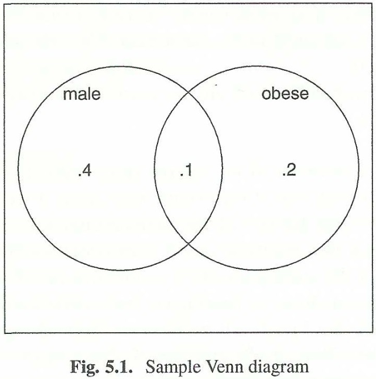
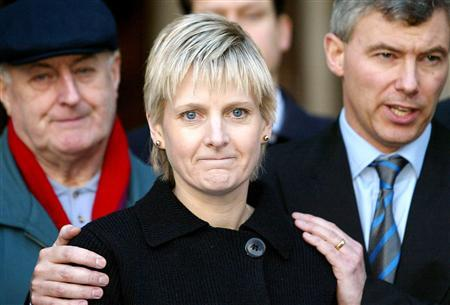

# Introduction
### Goal for Today

*Discuss probability and basic math, since these are things you should know anyway.*

# Probability
### Probability

Probability refers to the chance of some event occurring.

- It's a ubiquitous feature of the world and you should know it anyway.
- Interestingly, it was developed rather late in human history.
- Origins: gambling in the 17th-18th centuries.

We think in probabilistic terms, consciously or subconsciously.

- e.g. if I go 85 in a 65mph zone, I might get to my location faster or I might get a ticket, slowing down my progress.

Probability theory is a precursor to statistics and applied mathematics.

-  It’s mathematical modeling of uncertain reality.

## Basic Probability
### Rules of Probability

Here are some (but not all) important rules for probability.

1. Collection of all possible events ($E_1$ ... $E_n$) is a **sample space**.
	- *S* as a **set** for a coin flip *S* = { Heads, Tails }.
2. Probabilities must satisfy inequality 0 $\le$ *p* $\le$ 1.
3. Sum of probability in sample space must equal 1.
	- Formally: $\Sigma_{E_i \in S} \enspace p(E_i) = 1$
4. If event *A* and event *B* are *independent* of each other, the **joint probability** of both occurring is *p*(*A,B*) = *p*(*A*) * *p*(*B*).
5. If probability of event *A* depends on event *B* having already occurred, the **conditional probability** of *A* "given" *B* is a bit different.

$$
    p(A \thinspace | \thinspace B) = \frac{p(A , B)}{p(B)}
$$

### Rules of Probability

Conditional probability implies events are not wholly independent.

- i.e. some "overlap" or "intersect".

Thus, there are two other probability rules to know.

$$
    \text{\textbf{Probability of Unions:}} \quad p(A \cup B) = p(A) + p(B) - p(A \cap B)
$$

$$
    \text{\textbf{Probability of Intersections:}} \quad p(A \cap B) = p(A) + p(B) - p(A \cup B)
$$

### Some Simple Applications

Let's start with a basic Venn diagram from the book. Assume:

- Probability of being male (i.e. *p*(*A*)) = .5
- Probability of being obese (i.e. *p*(*B*)) = .3

We want to know:

- What's the probability of someone being male *or* obese?
- What's the probability of someone being obese, given we know he's a male?

### Venn Diagram

### Some Simple Applications

What's the probability of someone being male *or* obese?

- This is a union probability question.
- $p(A \cup B) = p(A) + p(B) - p(A \cap B)$ = .5 + .3 - .1 = .7
- We subtract the overlap (intersection) because some men are obese.
- Probability of being a non-obese female: 1 - .7 = .3

What's the probability of someone being obese, given we know he's a male?

- This is a conditional probability question.
- $p(A \thinspace | \thinspace B) = \frac{p(A , B)}{p(B)}$ = $\frac{.1}{.5} = .2$

We can derive more complex and important rules from these basic probability rules.

## Total Probability, Bayes' Theorem
### Total Probability and Bayes' Theorem

Recall: $p(A \thinspace | \thinspace B) = \frac{p(A , B)}{p(B)}$ . Thus: *p*(*A, B*) = *p*(*A* | *B*) * *p*(*B*).

- Further: *p*(*B, A*) = *p*(*B* | *A*) * *p*(*A*).
- Then, obviously: *p*(*A, B*) = *p*(*B, A*).
- Therefore: *p*(*B* | *A*) * *p*(*A*) = *p*(*A* | *B*) * *p*(*B*).

If you want to isolate *p*(*B* | *A*), simply divide by *p*(*A*).

$$
    p(B \thinspace | \thinspace A) = \frac{p(A \thinspace | \thinspace B) * p(B)}{p(A)}
$$

### Total Probability and Bayes' Theorem

This is an interesting theorem in its own right. It’s the **Total Probability Theorem**.

- We also commonly call this **Bayes' Theorem** after the man who discovered it.

With only two possible outcomes (*B* and ~*B*).

$$
	p(B \thinspace  | \thinspace  A) = \frac{p(A \thinspace | \thinspace B)p(B)}{p(A \thinspace  | \thinspace B)p(B) + p(A \thinspace |\sim B)p(\sim B)}
$$

### An Application: The Prosecutor's Fallacy

Assume this scenario: a zealous prosecutor is collecting evidence against a defendant.

- He has a fingerprint match, for which the random chance of it occurring is one-in-a-million.
- Put another way: $p(\text{fingerprint} \thinspace  | \thinspace \text{innocent} = \frac{1}{1000000}$) .

What do you think the prosecutor does? Argue the prospect of innocence is one-in-a-million.

- In short: prosecutors routinely forget that *p*(*B* | *A*) != *p*(*A* | *B*)!

### A Real Life Application of the Prosecutor's Fallacy

Sally Clark is a real-life horror story of the misuse of conditional probability.

### Sally Clark

Some background on this case:

- Sally Clark was a British solicitor.
- 13 Dec 1996: her seemingly healthy first-born child died a crib death at 11 weeks.
- 26 Jan 1998: her second-born died at 8 weeks.
- 23 Feb 1998: Clark was arrested on a count of double murder.
	- She had been suffering from postpartum depression.
	- Both children showed evidence of trauma (ostensibly from attempts at resuscitation).

### Sally Clark

In her trial, British prosecutors brought forward a pediatrics specialist who estimated the probability of crib death for two healthy babies from a wealthy family was in 1-in-73 million.

- Put another way: $p(\text{two crib deaths} \thinspace  | \thinspace \text{innocent} = \frac{1}{73000000}$) .
- Prosecutors then argued: $p(\text{innocent} \thinspace  | \thinspace \text{two crib deaths} = \frac{1}{73000000}$) .

9 Nov 1999: Sally Clark is convicted and sentenced to life in prison.

### The Error in this Case

Let's fill in some blanks to illustrate the error. Here's a reworked theorem:

$$
	p(H \thinspace  | \thinspace  D) = \frac{p(D \thinspace | \thinspace H)p(H)}{p(D \thinspace  | \thinspace H)p(H) + p(D \thinspace | \thinspace A)p(A)}
$$

Assume:

- *H* = both children died of crib death.
	- $p(H) = \frac{1}{100000}$ . Yes, the pediatrics expert actually confused a joint probability for a conditional probability in this case!
- *D* = both children died.
	- Trivially, *p*(*D* | *H*) = 1.
- *A* = both children died of alternate causes (i.e. murder).
	- *p*(*A*) = 1 - *p*(*H*).
- $p(D \thinspace | \thinspace A) = \frac{30}{650000}$ in the British case.

There are a *lot* of moving pieces in this particular case (e.g. absence of a social worker in the Clark family), but this will illustrate the problem.

### The Error in this Case

\begin{eqnarray}
p(H \thinspace  | \thinspace  D) &=& \frac{p(D \thinspace | \thinspace H)p(H)}{p(D \thinspace  | \thinspace H)p(H) + p(D \thinspace | \thinspace A)p(A)}     \nonumber \\
   &=& \frac{.00001}{.00001 +.0000046 *(1 - .00001)} \nonumber \\
   &=& \frac{.00001}{.0000145} \nonumber \\
   &=& .689 \nonumber
\end{eqnarray}

Put another way, the probability of Sally Clark's innocence was *much* higher than the misleading testimony offered by prosecutors.

### Sally Clark

The UK Royal Statistical Society eventually caught wind of this error and condemned it.

- Without proper context (i.e. the probability of a mother actually killing two children consecutively), Sally Clark's conviction was erroneous.
- Experts later found traces of staphylococcus aureus in the second-born.
	- The first-born likely died a true crib death.

Clark was later exonerated on appeal in 2003, but never recovered emotionally from the ordeal.

- She died in 2007.

# Counting
### Counting

A basic premise to computing probability is counting.

- It seems basic, but there are multiple ways of doing this.

There's a thing called the **Fundamental Theorem of Counting**:

1. If there are *k* distinct decision stages to a process...
2. ...and each has its own $n_k$ number of alternatives...
3. ...then there are $\prod_{i=1}^{k} n_k$ possible outcomes.

### Counting

What does this say in plain English?

- If we have a specific number of individual steps...
- ...each of which has some set of alternatives...
- ...then the total number of alternatives is the product of those at each step.

So, for 1, 2, ... *k* different characteristics, we multiply the corresponding $n_1, n_2, \ldots, n_k$ number of features.

### Four Methods of Counting

A form of counting follows choice rules of **ordering** and **replacement**.

1. Ordered, with replacement
2. Ordered, without replacement
3. Unordered, without replacement

There's a fourth method (unordered, with replacement), but it is intuitive, not much used, and I won't belabor it here.

### Ordered, with Replacement

This is the first and easiest method.

- Let's say we have *n* objects (e.g. a 52-card deck).
- We want to pick *k* < *n* objects (say: 5 cards).
- With replacement: we can put the card back and possibly pick it again.

By the **Fundamental Theorem of Counting**, there are always *n* choices for each of the five decision stages.

- Put another way: it's possible we could grab the King of Hearts five times.
- Total number of combinations = $n^k$ = $52^5$ = 380,204,032.

### Ordered, without Replacement

This is the second most basic approach.

- In our case, once we grab the King of Hearts, he's gone from the deck.
- Thus, in each stage, there's a decrement of choices.

Formally:

$$
	n * (n -1) * (n - 2) * (n - 3) * \ldots * (k + 1) * k = \frac{n!}{(n-k)!}
$$

Note: ! = a factorial. 5! = 5 * 4 * 3 * 2 * 1.

- In our case,  $\frac{52!}{(52-5)!} = 311,875,200$ .

### Unordered, without Replacement

There is a slightly more complicated, but still common form.

- Informally: like ordered without replacement, but we can't see the order of picking.

Suppose we were picking colored balls from an urn *S* = { White, Red }.

- Here, picking RWR, RRW, and WRR are equivalent to each other.

This leads to a slight modification of the previous formula.

$$
	\frac{n!}{(n-k)!k!} = {n \choose k}
$$

**Note**: you'll see a lot of this choose notation soon. Get used to it.

### An Application: Randomly Sampling a Population

Suppose you have a population of 150. You want to survey 15. How many different combinations do you have?

$$
	\text{\textbf{Ordered, with Replacement:}} \quad  n^k = 150^{15} = 4.378939 * 10^{32}
$$

$$
	\text{\textbf{Ordered, without Replacement:}} \quad \frac{n!}{(n-k)!} = 2.123561 * 10^{32}
$$

$$
	\text{\textbf{Unordered, without Replacement:}} \quad {n \choose k} = {150 \choose 15} = 1.623922 * 10^{20}
$$

### An Application: Forming a Coalition Government

Here is an application of relevant to party politics in Europe.

- Suppose we have three parties (Liberal, Christian Democrats, Greens).
- Liberals have six senior members. CDs have five senior members. Greens have four senior members.

How many different ways could you choose a cabinet of three Liberals, two Christian Democrats, and three Greens?

### An Application: Forming a Coalition Government

This can be solved with the **Unordered, without Replacement** counting rule.

- In short, it doesn't matter the order in which the members are drawn.
- All we have to do is select three Liberals, two CDs, and three Greens.

$$
{6 \choose 3} {5 \choose 2} {4 \choose 3} = \frac{720}{6(6)} * \frac{120}{2(6)} * \frac{24}{6(1)} = 20 * 10 * 4 = 800
$$

# Conclusion
### Conclusion

This lecture was in some measure math for math's sake.

- These are important concepts people should know for its own value.

However, they are important foundations for the applied stuff we will start doing soon.

