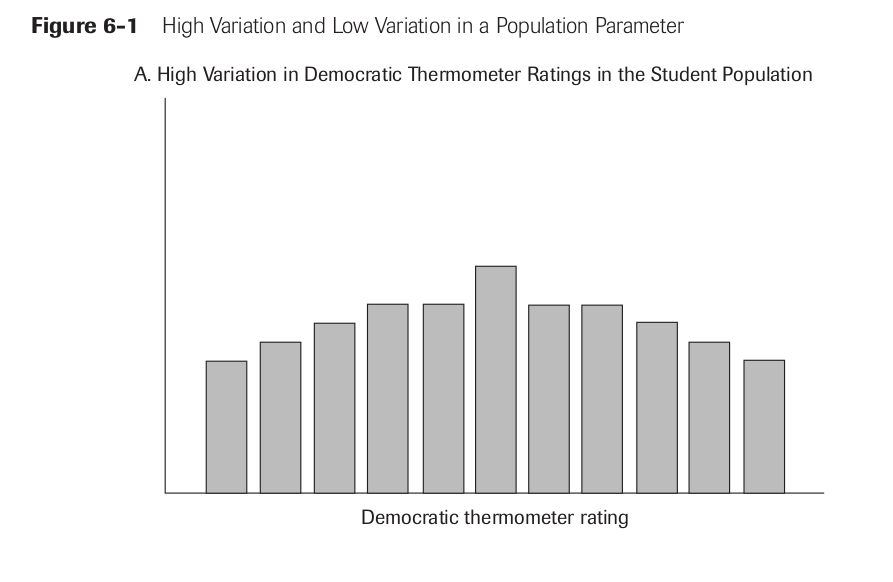
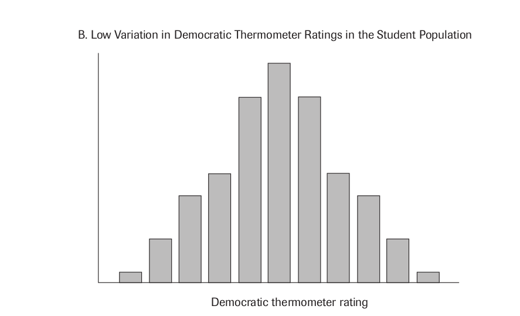
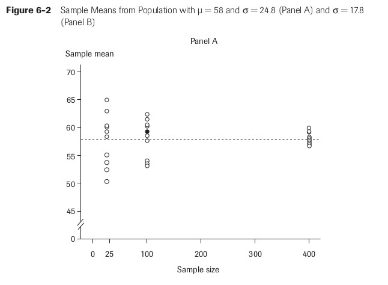
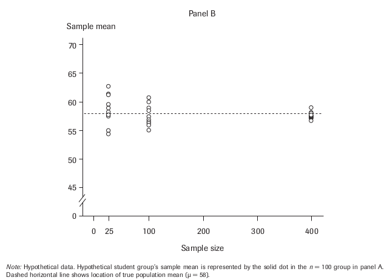

# Introduction
### Goal for Today

*Begin our discussion of inferential statistics with random sampling and variation.*

### Getting into Inferential Statistics

We are getting deeper into applied research design.

- We are no longer interested in just descriptive statistics.

We want to get into **inferential statistics.**

<!-- - This is a set of procedures to make statements about an unknown segment of a population by using a *sample* of that population. -->

### What is the Population?

Let's be clear with our terms.

- **Population:** the universe of cases we want to describe.
- **Population parameter:** the unknown segment of the population we want to estimate.

In our past examples, this would be American attitudes on gun control or political tolerance (for example).


### Sampling the Population

Big problem: we do not have data on approximately 300-million-plus Americans living in this country.

- Instead, we use a **sample**, a subset of cases drawn from the population.
- When done properly, the **sample statistic** gives us an estimate of the population parameter.

Instances in which we have the universe of all potential cases are called a **census**.

- Examples: Supreme Court decisions, wars in the modern state system.
- These create inferential issues of interest to Bayesians.

# Properties of the Random Sample
### The Random Sample

The sampling concept is a foundation of applied political science.

- However, it is possible to do this incorrectly.
- The implications of a botched sampling process are far-reaching.

A proper sampling process is called a **random sample**.

<!-- - All units of the population have equal probability of being included in the sample. -->
- This is analogous to random assignment in experimental design.
- The random sample has no issues of **selection bias.**
<!--	- This is when some units have greater probability of being in the sample than other units. -->

A random sample with no selection bias guarantees no systematic error in the sample and no issue of bias in our inferences.

## How (Not) to Obtain a Random Sample
### The 1936 Literary Digest Poll

Who would win the 1936 Presidential election? *The Literary Digest* wanted to know.

- It obtained names and addresses of all telephone users and car owners.
- It combined those names with the magazine's subscriber base to create a sample of 10 million people.
- *The Literary Digest* mailed sample ballots and received 2.4 million back.
- **Their conclusion:** Alf Landon would win in a landslide.

**Actual conclusion**: FDR won in a landslide. *The Literary Digest* went out of business a few years later.

### The 1936 Literary Digest Poll

How did *The Literary Digest* get this so wrong? The answer lay in the **sampling frame**.

<!-- - This is the process of gathering a sample from a population. -->
- Though such a sampling frame seems uncontroversial now, *The Literary Digest*'s sampling frame picked up mostly Landon supporters.

Mailing out ballots invited an additional issue of **response bias**.

- Those that *really* detested FDR were more likely to respond.

All told, the sample statistic differed systematically from the true, underlying population parameter.

- This is textbook bias in inferential statistics.

How do we not repeat *The Literary Digest*'s error?

### Obtaining a Random Sample

Professional polling firms like Gallup use random number generators.

- Every eligible unit of the population has a number applied to them.
- Your book mentions this with respect to a hypothetical university.
- A random number generator randomly draws *n* numbers from population.

Because the process is strictly random, any differences between the sample and those not sampled are also random.

## Sample Size
### Sampling Error

Eliminating bias *does not* eliminate error.

- Random sampling purposely introduces **random sampling error**.
- This may seem bad, but systematic error is always the greater evil.

We can actually estimate the random sampling error.

### Understanding Random Sampling Error

The population parameter that interests us is defined as follows.

- Population parameter = Sample statistic + R.S.E.
- "R.S.E." = random sampling error.

We consider two factors when we measure random sampling error.

1. The size of the sample
2. The amount of variation in the population parameter.

$$
    \textrm{R.S.E.} = \frac{\textrm{Variation component}}{\textrm{Sample size component}}
$$

### Understanding Random Sampling Error

Notice the fraction. As the sample size component increases, random sampling error decreases.

- However, the effect is non-linear.
- Sample size component is actually the square root of the number of observations in the sample.

$$
    \textrm{Sample size component} = \sqrt{n}
$$

### Sample Size

All else equal, an increase in sample size from 100 to 400 offers only a two-fold reduction in sampling error.

```{r}
28/sqrt(100)
28/sqrt(400)
```

The implication: increase the sample size by as much as possible.

### Sample Size

However, increasing the sample size may be costly.

- It may even incentivize non-random sampling.

This is why most surveys have a "sweet spot" between 1,000 and 3,000.

### Sample Size

```{r}
(28/sqrt(100))/(28/sqrt(1000))
(28/sqrt(1000))/(28/sqrt(10000))
```
## Sample Variation
### Sample Variation

As the variation component increases, random sampling error increases.

- Recall our discussion of variation in Chapter 2.

We have a statistic for this variation: the **standard deviation**.

- Used for interval-level variables
<!-- - It measures the extent to which cases in an interval-level distribution differ from the mean. -->

Look at Figure 6-1.

 - Figure 6.1a: high spread, high standard deviation
 - Figure 6.1b: low spread, low standard deviation

### High Variation and Low Variation



### High Variation and Low Variation



### Calculating Standard Deviation

We can actually calculate this.

- Assume known population values, *N* and \(\mu\).

*Important to know before going forward*:

- *N* refers to number of cases in a population. *n* refers to sample size.
- \(\mu\) refers to central tendency of population. \(\bar{x}\) refers to sample mean.

Important heuristic: Greek letters refer to properties of the population, not the sample.

### Calculating the Standard Deviation

1. Subtract \(\mu\) from every value in the population.
2. Square that deviation for every observation.
	- Example of Student 1 in Table 6-1: (-38)*(-38) - 1,444.
3. Add those squared deviations together.
	- This is the sum of squared deviations.
4. Calculate arithmetic mean for sum of squared deviations.
	- In Table 6-1: 6,678/11 = 615.3
	- This is an important statistic called the **variance**.
	<!-- - It measures how far spread the values in the population are. -->
5. Take the square root of the variance.

### Calculating the Standard Deviation


### Calculating the Standard Deviation


## Standard Error of a Sample Mean
### Standard Error of a Sample Mean

Random sampling eliminates error, but invites random error.

- We want to eliminate random error if we can.
- It's not as perilous as systematic error, but it's still unwanted noise.

One sure way to do this is to increase the sample size.

- Consider Figure 6-2.
- \(\mu\) is 58 in both panels, but standard deviation \(\sigma\) is greater in Panel A than Panel B.

Sometimes we can't do much about natural variation in the population, but we can increase the sample size to get more faithful sample statistics.

### Figure 6-2, Panel A



### Figure 6-2, Panel B



### Standard Error of a Sample Mean

We have our full formula for calculating random sampling error.

$$
    \textrm{Standard error of sample mean} = \frac{\sigma}{\sqrt{n}}
$$

Assume \(\bar{x}\) = 59, \(\sigma\) = 24.8, *n* = 100.

- Standard error = 2.48
- We believe the population parameter is between 56.2 and 61.48
- Since we know \(\mu\) = 58, we know that's true.

# Conclusion
### Conclusion

We can obtain a reasonable estimate of a known population parameter by randomly sampling the population.

- The sample estimate becomes a good guess of the population parameter when we know \(\mu\) a priori.

What we don't know yet:

- How likely is our \(\bar{x}\) going to be within one standard error of \(\mu\)?
- What if we don't know \(\mu\), but have an idea of what it could be?

These answers require knowledge of the central limit theorem and a normal distribution.


