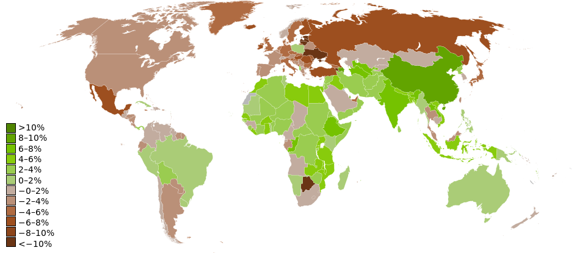
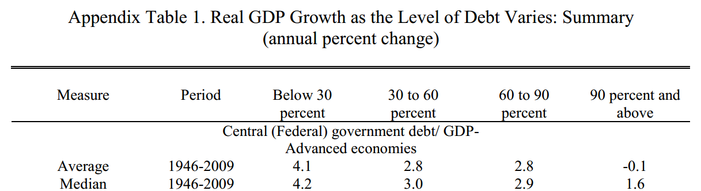

```{r setup, include=FALSE}
library(RCurl)
library(Zelig)
library(countrycode)
library(ggplot2)
library(mgcv)

data <- getURL("https://raw.githubusercontent.com/svmiller/reinhart-rogoff/master/RR-processed.csv")
Data <- read.csv(text = data)

summary(Data)

Data <- subset(Data, select=c("Country","Year","dRGDP","debtgdp"))
Data$ccode <- countrycode(Data$Country, "country.name", "cown")

Data$dgcat <- NA
Data$dgcat[Data$debtgdp > 0 & Data$debtgdp < 30] <- "0-30%"
Data$dgcat[Data$debtgdp >= 30 & Data$debtgdp < 60] <- "30-60%"
Data$dgcat[Data$debtgdp >= 60 & Data$debtgdp < 90] <- "60-90%"
Data$dgcat[Data$debtgdp >= 90] <- "90% and above"

summary(M1 <- lm(dRGDP ~ factor(dgcat), data=Data))

Data$dgcat2 <- NA
Data$dgcat2[Data$debtgdp > 0 & Data$debtgdp < 30] <- "0-30%"
Data$dgcat2[Data$debtgdp >= 30 & Data$debtgdp < 60] <- "30-60%"
Data$dgcat2[Data$debtgdp >= 60 & Data$debtgdp < 90] <- "60-90%"
Data$dgcat2[Data$debtgdp >= 90 & Data$debtgdp < 120] <- "90-120%"
Data$dgcat2[Data$debtgdp >= 120] <- "Above 120%"

summary(M2 <- lm(dRGDP ~ factor(dgcat2), data=Data))

Data$dgcat <- as.factor(Data$dgcat)
summary(Z1 <- zelig(dRGDP ~ dgcat, data = Data, model="ls"))

Z1.low <- setx(Z1, dgcat  = "90% and above")
summary(Z1.sim <-sim(Z1, x = Z1.low))

## Compare expected values of Y from Z1.sim with the means.
## The expected value of Y we got makes sense with the means, but not what RR reported.

(RR.correct.mean <- with(Data, tapply( dRGDP, dgcat, mean, na.rm=TRUE )))
RR.correct.mean.df <- data.frame(RR.correct.mean, dgcat=names(RR.correct.mean) )

## Let's start retracing RR's steps, starting first with equal weight means.

(RR.equalwt.mean <- with(Data, tapply( dRGDP, list(Country,dgcat), mean, na.rm=TRUE )))

## Recall that RR chose to omit Aussieland, New Zealand, and Canada for the first few years after WWII.
## These are inconsistent with their findings (but they chose to include the US in those years).
#######################################################################################################

RR.selective <- subset(Data,
                       !((Year<1950 & Country=="New Zealand") | (Year<1951 & Country=="Australia") | (Year<1951 & Country=="Canada") ))
(RR.selective.mean <- with(RR.selective, tapply( dRGDP, list(Country,dgcat), mean, na.rm=TRUE )))

# with(RR.selective, tapply( dRGDP, dgcat, mean, na.rm=TRUE ))

# Compare/contrast RR.selective.mean with RR.equalwt.mean. Look especially at New Zealand.

## Recall that RR also had a silly spreadsheet error that came from doing their work in Excel.
## This error is considered random, unless one assumes alphabetical order matters for the findings.

RR.selective.spreadsheet <- subset(RR.selective, ! Country %in% c("Australia","Austria","Belgium","Canada","Denmark") )
(RR.selective.spreadsheet.transcription <- with(RR.selective.spreadsheet, tapply( dRGDP, list(Country,dgcat), mean, na.rm=TRUE )))

## Compare RR.selective.spreadsheet.mean with RR.selective.mean.
## Look at what happened to Belgium in that right column.

## One final spreadsheet error coming up.

RR.selective.spreadsheet.transcription["New Zealand",4] <- -7.9

## And we think we've replicated RR (2010).

(RR.published.mean <- apply(RR.selective.spreadsheet.transcription,2,mean,na.rm=TRUE))
RR.published.mean.df <- data.frame(RR.published.mean , dgcat=names(RR.published.mean) )

(2.9*.143) + (2.4 *.143) + (1*.143) + (.7*.143) + (-7.9*.143) + (2.4*.143) + (-2*.143)

(3.8*.045)+(2.6*.227) + (3*.045) + (2.9*.173) + (2.4*.064) + (1*.091) + (.7*.10) + (2.6*.045) + (2.4*.173) + (-2*.036)

RR.gam <- gam(dRGDP ~ s(debtgdp, bs="cs"),data=Data)

## Cross-validation technique for loess parameters
## http://stats.stackexchange.com/questions/2002/how-do-i-decide-what-span-to-use-in-loess-regression-in-r
Graph <- ggplot(Data, aes(x=debtgdp,y=dRGDP))
Graph <- Graph + geom_vline(xintercept=90,color='lightgray',size=1.5)
Graph <- Graph + geom_point(color='darkgray') + ylab("Real GDP Growth") + xlab("Public Debt/GDP Ratio") + scale_x_continuous(breaks=seq(0,240,30)) + theme_bw()
Graph <- Graph + geom_smooth(method=gam, color='black',formula= y ~ s(x, bs = "cs"))
print(Graph)
```

# Introduction
### Goal for Today

*Discuss Reinhart and Rogoff's (2010) analysis of government debt and growth.*

# Debt and Growth as Current Policy Issue
### Debt and Growth as Current Policy Issue

The financial crisis of 2007-08 was not kind to many countries.

- Overdetermined causes: housing bubble, bank insolvencies, predatory lending, deregulation since 1999, etc.
- The great recession followed in 2009.

### The Effect of the Great Recession



### The Effect of the Great Recession

USA:

- Unemployment doubled, rising to 10.1% (highest in 30+ years)
- GDP *shrunk* from 2008 to mid-2010.
- Debt rose from 2/3rds GDP to over 100% of GDP.

Greece:

- Unemployment rose from 6% to 21% in three years.
- GDP contracted by over 20%.

Ireland:

- Unemployment rose from 6% to 15% in four years.
- Stock exchange hit a 14-year low.

# Reinhart and Rogoff's Argument
### Dealing with the Great Recession

Countries dealt with recession in the usual way: bailouts and deficit spending.

- Governments accrue debt to prevent further economic losses.

Reinart and Rogoff (RR) (2010) argue this is unwise.

- Debt accumulation like we're seeing now coincides with slowing growth (or, worse, further contraction).

### Reinhart and Rogoff's Method

Let's understand RR's research design.

- *Hypothesis*: as debt goes up, GDP growth goes down.

**Variables**:

- *DV*: GDP growth
- *IV*: public debt/GDP ratio
    - RR treat it as a series of fixed effects/factors.

## Findings
### Findings

RR provide "stylized facts" to illustrate debt/GDP and growth.


### Findings

- No relationship between debt/GDP and growth for bottom three debt categories.
- However, >90% and above category shows average GDP loss.
- No relationship between debt/GDP and inflation (the line graph).

### Findings



## The Importance of These Findings
### Policy Impact

RR make one of the loudest claims of the negative debt-GDP relationship. Impact includes:

- Numerous well-placed op-eds.
- Testimony before Congress.
- Features on FOX, NPR, MSNBC
- It also became the basis for the Ryan budget and similar austerity measures in Europe.

### Policy Impact


Paul Krugman (not pictured): RR may have had more immediate influence than any paper in history of economics.

### Policy Impact

Fiscal priorities in the West still reflect RR's findings.

- Follow politics closely and you'll see it.

However, the policy implications follow only if RR's findings are robust.

# Replicating Reinhart and Rogoff
### Replicating Reinhart and Rogoff

Question: did RR actually do their research well? How would we know?

- Fortunately, RR made their data publicly available.

### Read in the Data

\scriptsize
```{r eval=FALSE, tidy=TRUE,  tidy.opts=list(width.cutoff=50)}
library(RCurl)
library(Zelig)
library(countrycode)
library(ggplot2)
library(mgcv)

data <- getURL("https://raw.githubusercontent.com/svmiller/reinhart-rogoff/master/RR-processed.csv")
Data <- read.csv(text = data)
```
\normalsize

### Do Some Recoding/Cleaning

\small
```{r eval=FALSE}
Data <- subset(Data, select=c("Country","Year","dRGDP","debtgdp"))
Data$ccode <- countrycode(Data$Country, "country.name", "cown")

Data$dgcat <- NA
Data$dgcat[Data$debtgdp > 0 & Data$debtgdp < 30] <- "0-30%"
Data$dgcat[Data$debtgdp >= 30 & Data$debtgdp < 60] <- "30-60%"
Data$dgcat[Data$debtgdp >= 60 & Data$debtgdp < 90] <- "60-90%"
Data$dgcat[Data$debtgdp >= 90] <- "90% and above"

Data$dgcat2 <- NA
Data$dgcat2[Data$debtgdp > 0 & Data$debtgdp < 30] <- "0-30%"
Data$dgcat2[Data$debtgdp >= 30 & Data$debtgdp < 60] <- "30-60%"
Data$dgcat2[Data$debtgdp >= 60 & Data$debtgdp < 90] <- "60-90%"
Data$dgcat2[Data$debtgdp >= 90 & Data$debtgdp < 120] <- "90-120%"
Data$dgcat2[Data$debtgdp >= 120] <- "Above 120%"
```
\normalsize

### Regression Analysis

\scriptsize
```{r}
summary(M1 <- lm(dRGDP ~ factor(dgcat), data=Data))

```

\normalsize

### Regression Analysis

\scriptsize
```{r}
summary(M2 <- lm(dRGDP ~ factor(dgcat2), data=Data))

```

\normalsize

### Be Mindful What Your Regression is Saying

Did anyone see something amiss?

- Let's use `Zelig` to show the problem here.

\scriptsize
```{r eval=FALSE}
Data$dgcat <- as.factor(Data$dgcat)
summary(Z1 <- zelig(dRGDP ~ dgcat, data = Data, model="ls"))

Z1.low <- setx(Z1, dgcat  = "90% and above")
summary(Z1.sim <-sim(Z1, x = Z1.low))
```
\normalsize

### Expected Values of GDP Growth for >90% Debt

```{r echo=FALSE}
Z1.sim$stats[1]
```

See the problem now?

### RR's Summary Statistics

```{r echo=FALSE}
RR.correct.mean.df
```

The expected value of Y we got makes sense with the intercept (and these means), but it's not what RR reported.

- So what happened?

### Why Can't We Replicate RR?

Why can't we replicate RR's Figure 2 (and Table 1 from the Appendix)?

1. RR make curious case exclusions of Australia, Canada, and New Zealand shortly after WWII.
    - Argument: they're unique because it's WWII (a sui generis event).
    - However: they include the U.S. during that time.
2. RR also had a silly spreadsheet error that came from doing their work in Excel.
    - This omits Australia, Austria, Belgium, Canada, and Denmark from their analysis.
3. RR weight means equally by country rather than country year.
    - i.e. the U.S. has four years in the highest debt category (growth: -2%)
    - the UK has 19 years in the highest debt category (growth: 2.4%)
    - However, the four U.S. observations are weighted equally with the U.K.'s 19 years.
    
### Correct Means per Debt Category

```{r echo=FALSE}
RR.correct.mean.df
```

### What RR Reported

```{r echo=FALSE}
RR.published.mean.df
```

### Look Familiar?


### Another Look at the Debt/GDP Relationship

```{r echo=FALSE}
print(Graph)
```

# Conclusion
### Conclusion

RR still influence policy debates on debt and economic growth.

- However, their findings suffer from *major* inferential and workflow failures.

Don't make their mistakes when you do this yourself.