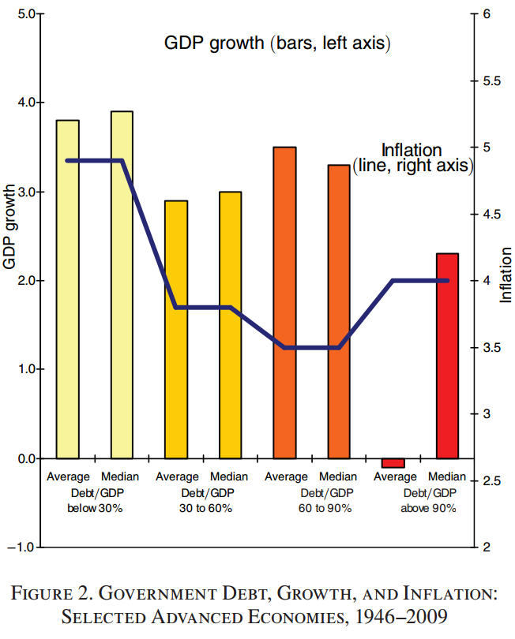

```{r setup, include=FALSE, cache=F, message=F, warning=F, results="hide"}
knitr::opts_chunk$set(cache=TRUE, warning=F, message=F)
knitr::opts_chunk$set(fig.path='figs/')
knitr::opts_chunk$set(cache.path='cache/')

knitr::opts_chunk$set(
                  fig.process = function(x) {
                      x2 = sub('-\\d+([.][a-z]+)$', '\\1', x)
                      if (file.rename(x, x2)) x2 else x
                      }
                  )
```

```{r loadstuff, include=FALSE}
knitr::opts_chunk$set(cache=FALSE)

library(tidyverse)
library(stevemisc)
library(knitr)
library(kableExtra)
library(mgcv)
library(brms)
library(modelr)
library(tidybayes)


data <- RCurl::getURL("https://raw.githubusercontent.com/svmiller/reinhart-rogoff/master/RR-processed.csv")
RR <- read.csv(text = data)  %>% tbl_df() %>% rename_all(tolower)
RR %>%
  mutate(dgcat = case_when(debtgdp > 0 & debtgdp < 30 ~ "0-30%",
                           debtgdp >= 30 & debtgdp < 60 ~ "30-60%",
                           debtgdp >= 60 & debtgdp < 90 ~ "60-90%",
                           debtgdp >= 90 ~ "90% and above")) %>%
  mutate(dgcat = as.factor(dgcat)) %>%
  select(country, year, dgcat, debtgdp, drgdp) -> RR

```


# Introduction
### Goal for Today

*Discuss Reinhart and Rogoff's (2010) analysis of government debt and growth.*

### R Packages We'll Be Using Today

```r
library(tidyverse)
library(stevemisc)
library(knitr)
library(kableExtra)
library(mgcv)
library(brms)
library(modelr)
library(tidybayes)
```

See my blog for more:

- http://svmiller.com/blog/2020/04/reinhart-rogoff-ten-years-later-replication/

# Debt and Growth as Current Policy Issue
### Debt and Growth as Current Policy Issue

The financial crisis of 2007-08 was not kind to many countries.

- Overdetermined causes: housing bubble, bank insolvencies, predatory lending, deregulation since 1999, etc.
- The great recession followed in 2009.

### The Effect of the Great Recession


### The Effect of the Great Recession

USA:

- Unemployment doubled, rising to 10.1% (highest in 30+ years)
- GDP *shrunk* from 2008 to mid-2010.
- Debt rose from 2/3rds GDP to over 100% of GDP.

Greece:

- Unemployment rose from 6% to 21% in three years.
- GDP contracted by over 20%.

Ireland:

- Unemployment rose from 6% to 15% in four years.
- Stock exchange hit a 14-year low.

# Reinhart and Rogoff's Argument
### Dealing with the Great Recession

Countries dealt with recession in the usual way: bailouts and deficit spending.

- Governments accrue debt to prevent further economic losses.

Reinart and Rogoff (RR) (2010) argue this is unwise.

- Debt accumulation like we're seeing now coincides with slowing growth (or, worse, further contraction).

### Reinhart and Rogoff's Method

Let's understand RR's research design.

- *Hypothesis*: as debt goes up, GDP growth goes down.

**Variables**:

- *DV*: GDP growth
- *IV*: public debt/GDP ratio
    - RR treat it as a series of fixed effects/factors.

## Findings

### Findings

> Our main result is that whereas the link between growth and debt seems relatively weak at “normal” debt levels, median growth rates for countries with public debt over roughly 90 percent of GDP are about one percent lower than other-wise; average (mean) growth rates are several percent lower.

### 



### Findings

- No relationship between debt/GDP and growth for bottom three debt categories.
- However, >90% and above category shows average GDP loss.
- No relationship between debt/GDP and inflation (the line graph).

## The Importance of These Findings
### Policy Impact

RR make one of the loudest claims of the negative debt-GDP relationship. Impact includes:

- Numerous well-placed op-eds.
- Testimony before Congress.
- Features on FOX, NPR, MSNBC
- It also became the basis for the Ryan budget and similar austerity measures in Europe.

### Policy Impact


Paul Krugman (not pictured): RR may have had more immediate influence than any paper in history of economics.

### Policy Impact

Fiscal priorities in the West still reflect RR's findings.

- Follow politics closely and you'll see it.

However, the policy implications follow only if RR's findings are robust.

# Replicating Reinhart and Rogoff
### Replicating Reinhart and Rogoff

Question: did RR actually do their research well? How would we know?

- Fortunately, RR made their data publicly available.

### Read in the Data

\tiny
```{r eval=FALSE}
data <- RCurl::getURL("https://raw.githubusercontent.com/svmiller/reinhart-rogoff/master/RR-processed.csv")
RR <- read.csv(text = data)  %>% tbl_df() %>% rename_all(tolower)
RR %>%
  mutate(dgcat = case_when(debtgdp > 0 & debtgdp < 30 ~ "0-30%",
                           debtgdp >= 30 & debtgdp < 60 ~ "30-60%",
                           debtgdp >= 60 & debtgdp < 90 ~ "60-90%",
                           debtgdp >= 90 ~ "90% and above")) %>%
  mutate(dgcat = as.factor(dgcat)) %>%
  select(country, year, dgcat, debtgdp, drgdp) -> RR

```
\normalsize

### Findings

The figure RR provide is kind of gaudy. Let's look at it in table form instead.

- Note: this is in an appendix provided along with the NBER working paper.

### Findings


### Findings

Had this article gone through formal/rigorous peer review, I suspect this would've been the jumping-off point.

- The descriptive stats from the figure do not match the table.
- The mean comes with no estimate of uncertainty.
- The discrepancy between median and mean suggest "average" doesn't look so average.

Making matters worse, the descriptive stats are not supported by RR's own data.


###

```{r}
RR %>%
  group_by(dgcat) %>%
  summarize(median = median(drgdp),
            mean = mean(drgdp)) %>%
  mutate_if(is.numeric, ~round(.,2))
```

### Why Can't We Replicate RR?

Why can't we replicate RR's Figure 2 (and Table 1 from the Appendix)?

1. RR make curious case exclusions of Australia, Canada, and New Zealand shortly after WWII.
2. RR also had a silly spreadsheet error that came from doing their work in Excel.
3. RR weight means equally by country rather than country year.

Take into account all those errors/design decisions and we can effectively approximate RR's findings.

### Selective Omission of Post-WWII Observations

RR suggest their data are universal, but they're not.

- They appear to engage in a conscious decision to exclude cases inconsistent with their hypothesis.

Page 11 of the working paper is the closest they come to acknowledging this.

> Of course, there is considerable variation across the countries, with some countries such as Australia and New Zealand experiencing no growth deterioration at very high debt levels. It is noteworthy, however, that those high-growth high-debt observations are clustered in the years following World War II.

###  Why the Post-WWII Case Exclusions Matter

Here, for context, are all the 1946-1949 observations.

```r
RR %>% filter(year < 1950) %>% group_by(country) %>%
  summarize(meandrgdp = mean(drgdp), 
            meandebt = mean(debtgdp),
            n=n()) %>% arrange(-meandrgdp) 
```

###

```{r, echo=F}
RR %>% filter(year < 1950) %>% group_by(country) %>%
  summarize(meandrgdp = mean(drgdp), 
            meandebt = mean(debtgdp),
            n=n()) %>% arrange(-meandrgdp) 
```


### Why the Post-WWII Case Exclusions Matter

There are 5 countries with average debt/GDP above 90%.

- Australia, Canada, New Zealand are excluded despite modest to robust growth.
- The UK and US are included, despite weak growth to economic contractions.
- Additionally: Belgium in 1947 had debt/GDP of 98.6%. Its growth: 15.2%.

Saying Australia, Canada, and New Zealand post-WWII are unique *but the U.S. isn't* is **really** dishonest.

- The end of WWII came with reduced demand for one of the U.S.' biggest exports: weapons.
- War demobilizations *always* created supply shocks/contractions before the advent of the military as we know it.


### The Microsoft Excel Error

This error commanded the most attention.

- RR's cell-based, click-oriented workflow had the unfortunate side effect of eliminating Australia, Austria, Belgium, Canada, and Denmark *entirely*.

Notice a pattern in those countries? They're the first five alphabetically.

- Functionally, this is *not* systematic bias (unless you believe macroeconomic indicators are function of English country names).
- In practice, though, it was.


###

\scriptsize

```{r, eval=F}
RR %>%
  # filter the five countries
  filter(country %in% c("Australia", "Austria", "Belgium", "Canada", "Denmark")) %>%
  group_by(country, dgcat) %>% # group by
  summarize(meanrgdp = mean(drgdp),
            # how many observations for that country in that category?
            n = n(), 
            # add the years to meanrgdp for categorical variable
            meanrgdp = paste0(round(meanrgdp, 2), " (",n,")")) %>% 
  select(-n) %>%
  spread(dgcat, meanrgdp)
```

\normalsize

###

```{r, eval=T, echo=F}
RR %>%
  # filter the five countries
  filter(country %in% c("Australia", "Austria", "Belgium", "Canada", "Denmark")) %>%
  group_by(country, dgcat) %>% # group by
  summarize(meanrgdp = mean(drgdp),
            # how many observations for that country in that category?
            n = n(), 
            # add the years to meanrgdp for categorical variable
            meanrgdp = paste0(round(meanrgdp, 2), " (",n,")")) %>% 
  select(-n) %>%
  spread(dgcat, meanrgdp)
```

### The Microsoft Excel Error

Notice Belgium, in particular. It has 25 observations in the 90% and above category.

- That's about 40% of all Belgian years and 22% of *all* observations in that debt category.

Under those conditions, Belgium reports robust growth (about 2.57%).

- It's not included at all in the analyses.

### Weighting by Country Rather Than Country-Year

This peculiarity is not as obvious, but it's just as influential when you understand what it's doing.

- RR weight the debt category growth means equally by country rather than years in a given debt category.

### Weighting by Country Rather Than Country-Year

Take, for example, the U.S.

- The U.S. had just four years in that top debt category (all, incidentally, just after WWII).
- The U.S. growth in that category: -1.99%.

Now consider the British cases.

- The UK had 19 years in that top debt category.
- The UK's growth in that debt category: 2.4%.

However, the U.S. four years appear to be weighted equally to the UK's 19 years in RR's reported statistics.

- By itself, this is largely enough to create the effect RR report.

###

\scriptsize

```{r, echo=T, eval=F}
RR %>%
  # Omit post-WWII cases for these three countries
  filter(!( year < 1950 & country == "New Zealand")) %>%
  filter(!( year < 1951 & country == "Australia")) %>%
  filter(!( year < 1951 & country == "Canada")) %>%
  # Omit first five countries alphabetically 
  filter(country %nin% c("Australia", "Austria", "Belgium", "Canada", "Denmark")) %>%
  group_by(country, dgcat) %>%
  summarize(meanrgdp = mean(drgdp),
            n = n()) %>% 
  # Incidentally, there's one more error: a transcription error.
  # New Zealand's average will be about -7.64. RR reported it as -7.9
  mutate(meanrgdp = ifelse(country == "New Zealand" & 
                               dgcat == "90% and above", -7.9, meanrgdp)) %>%
  # create some weights
  group_by(dgcat) %>%
  mutate(countryweight = 1/n_distinct(country),
         debtcatweight = n/sum(n)) %>%
  # Calculate the weighted means
  mutate(countrywmean = meanrgdp*countryweight,
         debtcatwmean = meanrgdp*debtcatweight) %>%
  group_by(dgcat) %>%
  summarize(countrywmean = sum(countrywmean),
            debtcatwmean = sum(debtcatwmean))

```

\normalsize

###

```{r, echo=F, eval=T}
RR %>%
  # Omit post-WWII cases for these three countries
  filter(!( year < 1950 & country == "New Zealand")) %>%
  filter(!( year < 1951 & country == "Australia")) %>%
  filter(!( year < 1951 & country == "Canada")) %>%
  # Omit first five countries alphabetically 
  filter(country %nin% c("Australia", "Austria", "Belgium", "Canada", "Denmark")) %>%
  group_by(country, dgcat) %>%
  summarize(meanrgdp = mean(drgdp),
            n = n()) %>% 
  # Incidentally, there's one more error: a transcription error.
  # New Zealand's average will be about -7.64. RR reported it as -7.9
  mutate(meanrgdp = ifelse(country == "New Zealand" & 
                               dgcat == "90% and above", -7.9, meanrgdp)) %>%
  # create some weights
  group_by(dgcat) %>%
  mutate(countryweight = 1/n_distinct(country),
         debtcatweight = n/sum(n)) %>%
  # Calculate the weighted means
  mutate(countrywmean = meanrgdp*countryweight,
         debtcatwmean = meanrgdp*debtcatweight) %>%
  group_by(dgcat) %>%
  summarize(countrywmean = sum(countrywmean),
            debtcatwmean = sum(debtcatwmean))

```

# Conclusion
### Conclusion

RR still influence policy debates on debt and economic growth.

- However, their findings suffer from both silly mistakes and, to be polite, questionable design choices.

Don't make their mistakes when you do this yourself.
