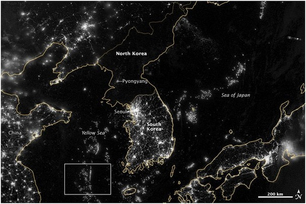

# Introduction
### Goal for Today

*Introduce students to issues of reliability, validity, and measurement error.*

### Concepts

We discussed the importance of concepts to the discussion of politics.

- We start with an interest in concepts like "political tolerance", "state development", or "war".
- We devise a conceptual definition, leading to an operational definition.

From this, we get an empirical *measure* of the concept.

- This allows us to proceed with political *science*.

# Measurement Error
### Concept and Measure

We seek to devise the best measure that best captures the "true" concept.

- However, there's always some slippage between concept and measure.
- We do our best to eliminate as much error as we can.

There are two types of measurement error.

1. **Systematic measurement error**: the chronic, consistent distortion of a measure, leading to a *mis*measure of the concept in question.
2. **Random measurement error**: haphazard, chaotic distortion of a measure, leading to an inconsistent operational reading of the concept.

## Systematic Measurement Error
### Systematic Measurement Error

Systematic measurement error is the bigger concern of the two.

- It can confound inference.

This was a big problem in the literature on political tolerance.

- *Concept*: the extent to which individuals express a willingness to "put up with" political attitudes or behavior they find objectionable.
- *Measure*: would you allow a communist or atheist to make a speech in your community/run for office?

	- Individuals that allow this are conceived to be "politically tolerant".
	
### What Was the Problem?

By the early 1980s, Americans looked to be much more tolerant than they were in the 1950s. Why?

- *Answer*: they weren't. Our measure of "political tolerance" was flawed.
- By inserting "least-liked groups", we biased our measure off what we wanted.
- We were measuring ideology, religious values, or variable fear of the USSR in the Cold War, not just "political tolerance".

When we allow individuals to name their least-liked group, Americans are still as politically intolerant as they had ever been.

### Hawthorne Effect

The **Hawthorne effect** is related to systematic measurement error.

- It's the phenomenon when individuals change their behavior when they know they're being monitored.

Examples in political science.

- Subjects in non-democratic countries are less likely to disclose true attitudes about the government.
- Americans tell survey researchers they vote when they often do not.
- Western Europeans tend to withhold racist statements to survey researchers.

## Random Measurement Error
### Random Measurement Error

Suppose I gave an undergrad a list of 500 MIDs to code.

- The task: code 1 if the MID is a war. Code 0 if it is not.
- Suppose the undergrad was sloppy and did half the cases while drinking beer and watching football.

	- A few 0s were coded as 1s and vice-versa.
	
This is ultimately an inconsistent error.

- It makes our estimates inefficient, but does not bias them.

# Reliability and Validity
### Reliability and Validity

Reliability and validity overlap our concerns of measurement error.

- **Reliability**: our measurement consistently captures the concept.
- **Validity**: our measure captures the "true value" of the concept without picking up unintended characteristics.

## Reliability
### Reliability and the Example of Political Tolerance

Let's revisit our measure of political tolerance.

- We (now) let the respondent name the group they like the least.
- Once identified, we ask a battery of questions related to the concept.

We typically use two measures.

1. Should [least liked group] be allowed to hold public demonstrations? 
2. Should [least liked group] be allowed to hold public office?

The politically tolerance individual is one who responded "yes" to both. 

### Reliability Tests

We can use a **test-retest method**.

- Reintroduce the questions at a later time
- Potential problem: is this measuring reliability of a measure or memory recall?
- It also require a panel study (i.e. same units measured over time).

### Reliability Tests

We could also use an alternative-form method.

- In this case, split the two questions previously used as an index.
- Introduce one at time point *t*. Introduce the other at time point *t + 1*.
- If the answer is "yes" at *t*, it should be "yes" at *t + 1*.
- Also requires a panel study.

There is also the option of a split-half method.

- Split the index and see if the items coincide. 
- If they do, we have a reliable measure.

## Validity
### Validity

We generally care more about validity and have two tests for it.

1. Face validity
2. Construct validity

### Face Validity

**Face validity** requires asking ourselves, "at face value, is this measure capturing what it is intended to capture?"

- The old tolerance measure from the 1950s failed by this metric.

### Face Validity and Observational Data

What about observational data? For example: how could we define inter-state "war"?

- We *could* define war as existing when a state of war is declared from one country against another.

Is this valid on its face?

- It will count most of the pivotal wars in European history.
- It would miss some important American wars (i.e. a reliability issue).

### Face Validity and Observational Data

Knowing the data would lead the researcher to say this is an invalid measure. Why?

- This measure would pick up at least 22 declarations of war associated with the end of World War II.
- In short, it is picking up unintended characteristics associated with state behavior near the end of World War II.

This is why our measures of war all focus on severity of violent conflict (i.e. at least 1,000 battle-related deaths a year).

### Construct Validity

**Construct validity** requires examining empirical relationships between the measure and measures for other concepts to which it should be related.

## An Applied Example
### An Applied Example of Kilowatt Hours per Capita

### The Problem of State Development

"State development" is an important concept in the study of comparative politics.

- Why are states like the U.S. and Canada "developed" and India and Angola are "developing"?

*Conceptual definition*: state development is the extent to which a country has an advanced economy and technological infrastructure in order to produce material well-being (in various forms) for its citizens.

### Kilowatt Hours per Capita as a Measure

We have the concept. Could kilowatt hours per capita be a measure?

- States developed to produce material well-being should consume energy in the production of those goods.
- We think the U.S. is "developed" because of its large infrastructure that can provide power across the country.

	- The consumption of energy might be a necessary condition, of sorts.

- Industries consume energy to increase the national product.

Compare/contrast the nighttime photos of North and South Korea.

- Measuring the concept of "state development" by looking at energy consumption might be novel.

### Kilowatt Hours per Capita as a Measure

**What I did**: get energy consumption data from the World Bank for 50 randomly selected countries in 2008.

### Top Ten Energy-Consuming States in my 2008 Sample

|   | Country | Kilowatt Hours per Capita |
|---|---------|:-------------------------:|
| 1 | Iceland | 50067 |
| 2 | Norway | 24867 |
| 3 | Canada | 17061 |
| 4 | UAE | 16891 |
| 5 | Finland | 16350 |
| 6 | Luxembourg | 15895 |
| 7 | Qatar | 15682 |
| 8 | Sweden | 14869 |
| 9 | USA | 13654 |
| 10 | Bahrain | 13144 |

### Face Validity

Does this measure of state development look valid on its face? Maybe not?

- The top energy-consumers are small states (e.g. Iceland).
- Countries like Qatar are more "developed" than the U.S.
- Is this measure picking up population density or small states?

It’s tempting to say this, but I don’t believe so.

- Densely populated Countries like Singapore, Malta, and Bangladesh are not biased upward.
- We are not looking for a measure that tells us the OECD countries are superior.

### Construct Validity

Is this variable empirically related with other variables to which it should be related?

- If a state is truly developed, the average citizen should have more material wealth than the citizen in a developing state.
- Thus, we should expect a relationship between our variable and gross national income.

**What I did:** Grab gross national income per capita data for each of the 50 countries randomly sampled.

- Thereafter, I regressed this other variable on kilowatt hours per capita.
- Consider this a preview. We will go over linear regression in considerable detail later in the course.

### Regressing Kilowatt Hours per Capita on GNI per Capita

|          | Estimate | Std. Error | t value | Pr(>t) |
|---------:|---------:|-----------:|--------:|---------:|
| (Intercept) | -142.4559 | 1086.3390 | -.013 | 0.8962  |
| Kilowatt hours per capita | 3.2269 | 0.2059 | 15.67 | 0.0000 |

The regression results suggest that the two variables are indeed strongly associated, which we expected.

# Conclusion
### Conclusion

This class started with an emphasis on linking concept and measure.

- However, no measure will perfectly capture the concept.
- Thus, we ask about problems of measurement, namely invalid or unreliable measures.

Our pedagogical exercise regarding state development further illustrates validity tests in measurement in political science.