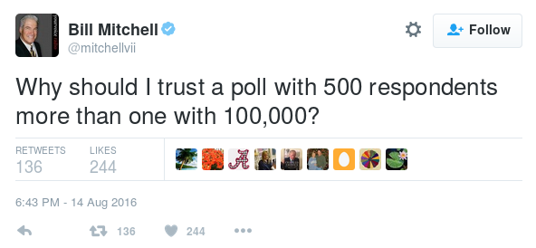

```{r setup, include=FALSE, cache=F, message=F, warning=F, results="hide"}
knitr::opts_chunk$set(cache=F,
                      fig.path = 'figs/',
                      cache.path='cache/',
                      warning=F,
                      message=F)

knitr::opts_chunk$set(
                  fig.process = function(x) {
                      x2 = sub('-\\d+([.][a-z]+)$', '\\1', x)
                      if (file.rename(x, x2)) x2 else x
                      }
                  )
```

```{r loadstuff, include=FALSE}
library(tidyverse)
library(stevemisc)

GSS7218 <- qs::qread("/home/steve/Dropbox/data/gss/GSS_spss-2018/gss7218.qs")

GSS7218 %>% filter(year == 2018) %>%
  select(sex, realrinc, occ10, prestg10) %>%
  mutate(prestgf = floor((prestg10)/10)) %>%
  mutate(gender = ifelse(sex == 1, "Male", "Female")) -> wage18

```

# Introduction
### Goals for Today

1. Provide an overview of the research process.
2. Illustrate some inferential fallacies/pitfalls in common discourse.
3. Discuss aims and uses of statistics.

# The Research Process
### Research as a Process

Scientific research is a process that entails the following.

1. Developing an empirically answerable question.
2. Deriving a *falsifiable* hypothesis from a theory purported to answer the question.
3. Gathering/analyzing data to test the hypothesis.
4. Rejecting or failing to reject the hypothesis.
5. Relating results to theory from which the question was drawn.

## What Research is Not
### What Research is *Not*

There are three things that are not considered scientific research.

1. Reviewing literature on a topic.
2. Theory construction in the absence of empirical data.
3. Gathering data without a research question.

### Research is More than a Lit Review

A lit review is an important part of research.

- We can't go far without reviewing what we already (don't) know on a topic.

However, research entails an original contribution.

### Research is More than Theorizing

Theory-writing *is* perhaps the most important part of scientific research.

- It's a rigorous, logical process.

By itself, it's not an *empirical* process, though.

- Scientific research entails an analysis of some form of data.

### Research is Data Analysis with a Purpose

Data collection/analysis alone is not research.

- Why are the data being collected or analyzed?
- What question is being answered?
- What theory is being tested?

By this metric, even the U.S. Census can't be considered research.

- Census data is certainly used in research.
- By itself, it's not research.

## Replication as Research
### Replication as Research

Replication *is* research.

- It's the process of repeating an experiment or study to verify the original findings.
- Even your "volcano" science experiment in junior high counts as replication of centuries-old hypotheses on acids and bases.

Sadly, it's difficult to get such work published.

- Few people in political science want to hear about what we already know.
- Failures to replicate may hinge on small factors.

Still, failures to replicate all of a finding may lead to a qualification of the original findings.

## Stages of Research
### Stages of Research

1. Causal theory
2. Hypothesis
3. Empirical test
4. Evaluation of hypothesis
5. Evaluation of causal theory
6. Advance in scientific knowledge

### Perspective Matters

A perspective is a general orientation to the world. They're untestable because:

1. They're too broad. Empirical support will never be total.
2. Perspectives are slippery and contextual.
	- e.g. "Government should stay out of our lives."
3. Any empirical data observed can be interpreted to fit the perspective.

We start with perspectives because we're not blank slates.

- Rationality, for example, informs our general theories and the data-collection process.

### What is a Theory?

Theories follow perspectives.

- They're systematic purported explanations of how the "world" (or part of it that interests the researcher) operates.

Theories are too abstract to be tested.

- However, they lend themselves to operationalizations of the theory's concepts.
- We end up testing the theory's predictions (or hypotheses).

### Hypotheses
	
- Hypotheses are the *falsifiable* statements.

	- i.e. they are able to be "proven wrong".
	- They also entail a means of operationalization (i.e. variables).
	
### Knowledge Accumulation

Results from empirical tests add to (or even refute) standing scientific knowledge.

- Copernicus: *On Revolutions of the Heavenly Spheres*.
- Lazersfeld et al. (1944): *The People's Choice*.

Empirical tests can culminate in **paradigm shifts**, leading to new research agendas.

- The "first principle of wing-walking" is a metaphor for when we should jettison research paradigms in favor of new ones.
	
### Summary of the Research Process

Different disciplines have different norms about this process.

- Political science has mostly moved from "grand theorizing" toward mid-level theorizing.
- The emphasis on perspectives may be more for sociology than political science.

	- Rationality (or liberalism) may be the ubiquitous perspective.
	- i.e. People/firms/states are self-interested and instrumentally rational.
	
Perhaps political science looks more like: puzzle -> research question -> theory -> hypotheses -> analysis.

- However, this streamlined process assumes a level of expertise you may not have yet.
- You may also find your original research question too broad to start.


## The Relationship between Research and Proof
### Research Does Not Prove

The research process is a deductive exercise.

- Each stage is a consequence of the previous stage.
- As a result, we can't prove theories true.
- At the most, we say our findings are consistent with the theory.

### Affirming the Consequent

Generally, our hypotheses look like forms of an argument or syllogism.

- If my theory is valid (A), my predictions about the data will be correct (B).
- If we observe B, we cannot prove A.

### Affirming the Consequent

Take a simple logical example: if Dabo Swinney wins the lottery (A), he will be rich (B).

- Dabo Swinney is rich.
- Therefore, Dabo Swinney won the lottery.

We know this is not true.

- i.e. Swinney is rich because he's a college football coach.

### Denying the Consequent

Research can't prove a theory true, but it can disprove one.

- i.e. if A, then B. Not-B. Therefore, Not-A.

Take a simple logical example.

- If it rained (A), then my yard will be wet (B).
- My yard is not wet.
- Therefore, it didn't rain.

If the data don't support the hypothesis, you can reject all or part of the theory.

# The Importance of Statistics
### Statistics in Daily Life

The world is moving toward statistics and quantification.

- Macroeconomic indicators
- Polling information
- "Big Data"

All these and more inform politics and policy.

- Understanding statistics may be necessary to being a good democratic citizen.

### Statistics in Daily Life

Still, statistics are maligned in education and society.

- Lies, damned lies, etc.
- AP Stats is optional in high school.
	- Some states (Texas, prominently) are eliminating math requirements like Algebra II.
- Many statistics departments don't offer undergrad majors.
- Stats (i.e. math) anxiety

Statistics pervade society but are simultaneously treated with dread and suspicion.

## The Use of Statistics
### What Do Statistics Do?

Statistics hold no intrinsic fact.

- They're contingent on a good interpretation.

For example, what would a 10% unemployment rate mean?

- Lazy people not looking for work.
- Recession (i.e. cutting payroll to maintain a profit).
- Younger working-age population (i.e. supply < demand).

Absent any other information, this statistic means little.

- But, it can easily sway opinion, absent a solid foundation for inference.

### What Do Statistics Do?

There are three main purposes of statistics.

1. Summarizing data (i.e. central tendency and spread)
2. Inferring from sample data to population
3. Forecasting the future from data

This class will focus on all three purposes (the first two more than the third).

## Squaring Statistics with Personal Experience
### Personal Experience

Drawing conclusions about a population from a sample is called "inferential statistics"

- A random sample statistic conforms to a known population statistic given a decent-sized *random* (or small, but repeated) sample.

This is often the hardest thing for the uninformed to accept about statistical practice.

- "How can this be accurate if I've never been polled and no one I know was polled?"

<!-- ### Bill Mitchell Needs a Methods Class

 -->

### Personal Experience

There are many intuitive responses to this.

- There are 300-million-plus Americans. The odds of appearing in a random sample are quite small.
	- About 500,000 to 1.
- Your experience may not be typical. Don't assume it is absent other information.
	- You're also likely to surround yourself with people in similar circumstances.

### An Application: The Wage Gap

Students should be familiar with the wage gap between men and women.

- i.e. Women make about 77 cents of the man's dollar for equal work and credentials.
- Given this, we should expect a future random sample of the population will yield the same results.

Possible objection: "How can that possibly be true? I know plenty of women who make more than men."

### An Application: The Wage Gap

```{r, echo=F, eval=F}
wage18 %>%
  group_by(gender) %>% summarize(meangenderinc = mean(realrinc, na.rm=T)) %>% data.frame ->  meangenderinc


wage18 %>% 
  group_by(gender) %>%
  mutate(meaninc = mean(realrinc, na.rm=T)) %>%
  filter(sex == 2 & !is.na(realrinc)) %>%
  filter(realrinc > meangenderinc[2,2])
```

Well, both are true. Just be mindful what you're saying. Using 2018 GSS data (standardized to 1986 USD):

- Average income for men: ~$30,560
- Average income for women: ~$19,979
- About 20% of women earned more than the average man.
- About 39% of men earned less than the average woman.

In short, men make more than women and many women earn more than the average man.

### 

```{r average-income-gender-occupational-prestige-group, eval=T, echo=F, fig.height=8.5, fig.width = 14}
wage18 %>% group_by(gender, prestgf) %>%
  summarize(meaninc = mean(realrinc, na.rm=T), 
            sd = sd(realrinc, na.rm=T), 
            se = sd/sqrt(n())) %>%
  filter(prestgf %in% c(2:7)) %>% haven::zap_labels(.) %>%
  mutate(prestcat = dplyr::recode(prestgf,
                                  `2` = "Prestige Score:\n[20-29]",
                                  `3` = "Prestige Score:\n[30-39]",
                                  `4` = "Prestige Score:\n[40-49]",
                                  `5` = "Prestige Score:\n[50-59]",
                                  `6` = "Prestige Score:\n[60-69]",
                                  `7` = "Prestige Score:\n[70-79]")) %>%
  ggplot(.,aes(prestcat, y=meaninc, ymin=meaninc-se, ymax=meaninc+se,color=gender, shape=gender)) +
  theme_steve_web() +
  scale_colour_brewer(palette = "Set1") +
  scale_y_continuous(labels = scales::dollar) +
  geom_pointrange(position = position_dodge(width = .5),size=.8) +
  labs(title = "Average Income by Gender and Occupational Prestige Group",
       x = "Prestige Categories",
       y = "Average Income (with Standard Error Intervals)",
       shape = "", color="",
       subtitle = "Mostly standardized to occupation, there are still major differences in gender disparity in the bulk of the data.",
       caption = "Data: General Social Survey (2018). Income measured in 1986 USD.")
```

### Cautious Inference

Your individual experience does not invalidate a general pattern.

- No number of anecdotes can invalidate a properly established general pattern.
- This is akin to the problem of induction.

How is this not a logically valid means to inference?

- "Black swan events"
- Need infinite confirming events.
- Ultimately, the premises may be true but the conclusion could be false.

Related, group statistics may not be good for constituent group members.

- This is an "ecological fallacy", akin to a form of stereotyping.

### Hasty Generalizations and "the Food Stamp Surfer"


### Hasty Generalizations and "the Food Stamp Surfer"

Induction and personal experience invite "hasty generalizations".

- i.e. "all X are Y"
- We see this in the case of Fox News' (then) infatuation with "the Food Stamp Surfer".

Accepting the conclusions of his peculiar case requires all the following:

- Leveraging just one case over a population of cases.
- Excluding other potential antecedent conditions.
- Infinite cases like him among the food-stamp-recipient population.

Conversely, the opposite generalization is also hasty and equally fallacious.

# Conclusion
### Conclusion

This lecture discussed the process of scientific investigation.

- There are some forms of inquiry that don’t qualify as research.
- There are quirks to each discipline, but the process is mostly shared across all forms of science.

As you start thinking of your projects, start thinking about what your process will look like in each stage.

### Conclusion

Your personal experience makes you who you are, but it's a poor guide to inference.

- You cannot generalize (in any direction) from your personal experience.
- This is tough for beginners to grasp, but it's one of the most important lessons.

Proper use of statistics allows for generalizable claims, albeit with specified limits and qualifiers.

### Pro-tip of the Day

Do you know how to use Google Scholar? If not, learn it now.

- Go to scholar.google.com. Select "Settings".
- Select "Library Links" on the left.
- Enter Clemson in the search field. Select a "Full-text @ Clemson" option. Save.
- Return to scholar.google.com. Search for some article.
- Click "Full-text @ Clemson" option on the right.
- Sign in (if necessary) to Clemson's library to retrieve it.