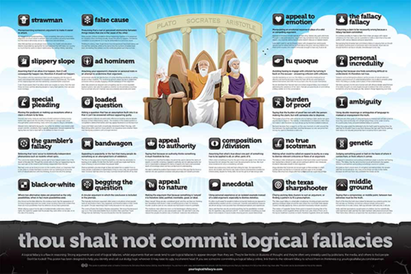

# Introduction
### Goal for Today

*Discuss how to organize and write a theory for an original paper.*

# Theory as a Form of Syllogism
### Theory as a Form of Syllogism

Good theories are akin to an extended syllogism.

- If A, then B
- If B, then C
- Therefore, if A, then C

###  A Simple Example

1. If I sleep through my alarm, I cannot take the final.
2. If I don't take the final, I will not pass this class.

Therefore, if I sleep through my alarm, I will not pass this class.

### Consistency 

Do note: if I accept the premises, I must accept the conclusion.

- Otherwise, I've contradicted myself.

Likewise: if I accept the premises that underpin your theory's prediction, I'm going to accept it if your theory's prediction is consistent with the results from your analysis.

###  Logical Fallacies to Note

Avoid committing the following in writing your theories.

- Composition/division fallacy
- Ecological fallacy
- Equivocation (i.e. ambiguity)
- Slippery slope
- Tautology

### When in Doubt...

...check the poster.

# Strategies for Developing Good Theories

### Think Formally

Formally outlining your theory (i.e. using "math") is arguably the most effective path to theory-writing.

- Surprise: it may also be the most difficult/with highest learning curve.

There's an unmistakable precision to a formal model done well.

- Even the simpler ones do well.

### The Classic Case of Turnout

Consider this classic puzzle. Assume:

- Citizens are rational (i.e. "self-interested" with structured preferences).
- Citizens are expected utility maximizers (i.e. trying to get most benefit at the least cost).
- All activity carries some form of cost (e.g. transaction, opportunity)

Then why does *anyone* vote?

### A Formal Model of Individual Turnout

Simply: citizens vote when the benefit outweighs the cost. Our terms:

- $R_i$: net reward individual receives from voting.
- $B_i$: benefit individual receives from success of most preferred candidate.
- $C_i$: cost incurred from voting.
- $P_i$: probability an individual casts deciding vote.

The expected utility calculation follows:

$$ R_i = (P_i * B_i) - C_i $$

The individual does not vote when $R_i < 0$.

### A Formal Model of Individual Turnout

Let's insert some values.

- $B_i$ = 1 (i.e. max utility for winning candidate)
- $C_i$ = .04 (i.e. voting takes about an hour from your day)
- $P_i$ = .001 (i.e. Florida in 2000, $\frac{1}{537}$)

Therefore:

$$ R_{i} = (.001 * 1) - .04 = .001 - .04 = -.039 $$

*It is irrational for any one person to vote.*

- Yet, so many people do. Why?

### A Formal Model of Individual Turnout

Riker and Ordeshook (1968): There must be some kind of "expressive" utility to voting that's not captured in this formula.

- i.e. $R_i = (P_i * B_i) - C_i + D_i$.
- Let $D_i$ be the utility a citizen gets from contributing his/her vote, doing his/her democratic duty, etc.
- There are, no doubt, several creative ways to empirically test this theory.

Do note: we've better solved a puzzle of turnout, but said nothing about elections, campaigns, socialization effects, etc.

- The model is a map...

### Don't Lose Sight of Institutions and Context

Consider this Condorcet voting situation among three people about a hypothetical foreign policy quagmire. There are three options:

1. Surge (S)
2. Withdraw (W)
3. Stay the course (SQ)

### A Hypothetical Foreign Policy Quagmire

A is desperate for a change of strategy.

- S > W > SQ

B is a dove.

- W > SQ > S

C is patient, but hawkish.

- SQ > S > W

### A Hypothetical Vote

Assume the three voters decide first among S or W.

- S beats W because A and C outnumber B.

They next decide on S or SQ.

- SQ beats S because B and C outnumber A.

B, the opportunistic dove, introduces W again.

- W beats SQ because A and B outnumber C.

### Arrow's Impossibility Theorem

This is an example of Arrow's impossibility theorem.

- i.e. no rank-order voting system can be designed to satisfiy all "fairness" criteria for social choice.

In other words, the rules matter.

- Institutions shape what behavior is permittable, possible.

### Think Strategically

Related: think of most behavior you observe as strategic.

- i.e. two or more actors are behaving rationally in pursuit of some scarce good, mindful that everyone is doing the same.

Avoid the "Robinson Crusoe fallacy"

- i.e. thinking rationally while forgetting about a strategic context.

### Outline Your Argument

See the forest for the trees first and outline your argument.

- Use sentence fragments if you need it.
- Carefully outline your claim.

### An Example from My Own Work

Consider my 2017 *CMPS* article:

1. Disputed territory is the most war-prone issue in the international system.
2. It influences the domestic political processes of the state.
3. This influences individual-level political attitudes as well.
4. The first real effect of disputed territory is fear of external rival.
5. Citizens offset this fear by looking to the state leader to provide for them.
6. This "providing" is more than symbolic; citizens want aggressive means to security.
7. Citizens will want to empower the state leader to quickly provide this.
8. Citizens will see institutional rivals/process as hindrances to this goal.
9. Citizens will want a form of government in which the leader can rule by discretion.

Therefore, disputed territory leads citizens to want a form of government in which the leader can rule by discretion.

# How Do I Know if My Theory is Good?
### How Do I Know if My Theory is Good?

1. Does your theory answer the question? (Recall: "models")
2. Is your theory causal?
3. Can we test it on new data?
4. How general is your theory?
5. How parsimonious is your theory?
6. How new is your theory?
7. How "nonobvious" is your theory?

# Conclusion
### Conclusion

Theory-writing is the hardest part of political science, but these tips should help.

- Think of it as an extended form of a syllogism.
- *Carefully* bullet-point your intuition before fleshing it out in paragraph form.
- Think formally and be mindful of the rules and strategic context.
- Parsimony is a virtue.
- Take proper nouns out of it.
- Don't let data drive your theory.