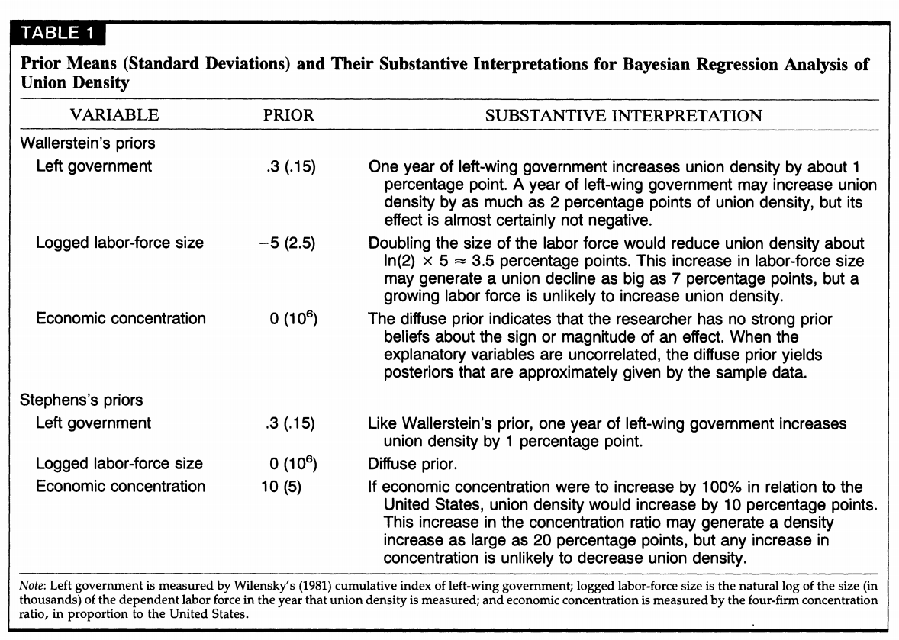

```{r setup, include=FALSE, cache=F, message=F, warning=F, results="hide"}
knitr::opts_chunk$set(cache=TRUE, warning=F, message=F)
knitr::opts_chunk$set(fig.path='figs/',  fig.width=14, fig.height=9)
knitr::opts_chunk$set(cache.path='cache/')

knitr::opts_chunk$set(
                  fig.process = function(x) {
                      x2 = sub('-\\d+([.][a-z]+)$', '\\1', x)
                      if (file.rename(x, x2)) x2 else x
                      }
                  )
```

```{r loaddata, echo=F, eval=T, message=F, warning=F}

library(tidyverse) # for most things
library(stevemisc) # for formatting and r2sd()
library(stevedata) # for ?uniondensity
library(modelsummary) # for tables
library(kableExtra) # for prettying up tables
library(ggrepel) # for graph
# source("1-replicate-westernjackman1994bicr.R")
con <- DBI::dbConnect(RSQLite::SQLite(), "westernjackman1994bicr.db")

skable <- function(data, caption, aligns,  colnames) {
  require(knitr)
  require(kableExtra)
  knitr::kable(data, caption = caption, col.names = if(missing(colnames)) { names(data)} else { colnames }, format = "latex", booktabs = TRUE, longtable =T, linesep = "", align = if(missing(aligns)) {} else { aligns }) %>%
    kable_styling(full_width = F, 
                  latex_options = c("repeat_header", "hold_position")) %>%
    row_spec(0, bold= TRUE)
}

```

# Introduction
### Goal(s) for Today

- *Show students implementation of Bayesian methods.*
- *Introduce students to replicating an article they actually (hopefully) read.*

###  What Bayesian Want and Why

What Bayesian want:

- To know about the population parameter, given the data.
- Extend Bayes' theorem as a means to answering that question.
- To embrace/state outright the implications of subjective probability.

Why Bayesians want this:

- Frequentist inference gives a backdoor answer to the motivating question.
- Data-generating processes assumed by central limit theorem may not hold in real world.

### The Benefits and Limitations

Benefits:

- Actually answers the question that interests us in inferential statistics.
- Declares/models outright prior beliefs/distributions.
- Uncertainty distributions come free in model output.
- Great for debugging/diagnosing/correcting problems in models.

Drawbacks:

- Computationally demanding
- Potential for "deck-stacking" (which is more of a strawman critique)

### What We'll Do Today

1. Walk through Western and Jackman (1994) as one excellent introduction to Bayesian inference.
2. Update/replicate their findings with newer Bayesian methods (via Stan/`brms`)

See my blog for more detail:

http://svmiller.com/blog/2019/08/what-explains-union-density-brms-replication/

### R Packages We'll Be Using Today


\small
```{r, echo=T, eval=F}
library(tidyverse) # for most things
library(stevemisc) # for formatting and r2sd()
library(stevedata) # for data(uniondensity)
library(ggrepel) # for repelling labels
library(kableExtra) # for prettying up tables

# source("1-replicate-westernjackman1994bicr.R")
# ^ requires brms, tidybayes
con <- DBI::dbConnect(RSQLite::SQLite(), "westernjackman1994bicr.db")
# ^ Contains all model summaries and draws.
```
\normalsize


# Western and Jackman (1994)
### Western and Jackman (1994)


## Nonstochastic and Weak Data
### Nonstochastic and Weak Data

Two properties of comparative research violate foundations for frequentist inference.

1. Nonstochastic data (i.e. non-random DGP)
2. Weak data

### Nonstochastic Data

Frequentist inference assumes data are generated by a repeated mechanism like a coin flip (hence: RDGP).

- A sample statistic is just one possible result from a draw of a probability distribution of the population.

### Nonstochastic Data

However, political scientists can define the sample on the population. Examples:

- OECD countries
- Militarized interstate disputes
- Supreme Court decisions

You know what this is. We called this a **census**.

### Nonstochastic Data

Frequentist inference is inapplicable to the nonstochastic setting.

- If we took another random draw, we'd get the exact same data.
- "Updating" the data doesn't generate a new random sample.
- Appeals to a "superpopulation" don't help either.

### Weak Data

This takes on two forms in political science research.

1. Small *n*
2. Collinearity

If the population of interest is "advanced industrial societies", our *n* is limited to about two dozen observations.

- We run out of degrees of freedom quickly when adding controls.

### Weak Data

The issue of **multicollinearity** also arises in weak data with small *n*.

- This is when two predictors are so highly correlated that their estimated partial effects are uninformative.

### Weak Data

This is relevant to a debate Western and Jackman address: what accounts for the percentage of the work force that is unionized?

- Wallerstein: size of civilian labor force (-).
- Stephens: industrial concentration (+).

Both agree that left-wing governments (see: Wilensky's (1981) index) matter as a control variable, but disagree about these two variables.


###

```{r, echo=F}
uniondensity %>%
  mutate_if(is.numeric, ~round(., 2)) %>%
  kable(., format="latex",
        caption = "The Data at the Heart of this Academic Dispute",
        col.names = c("Country", "Union Density", "Left Government", "Logged Labor Force Size", "Industrial Concentration"),
        align=c("l","c","c","c","c"),
        booktabs = T, longtable=T, linesep="") %>%
  kable_styling(font_size = 7) %>%
  row_spec(0, bold= TRUE) 
```

### The Problem of Weak Data

Problem: both are highly collinear (*r* = -.92).

- In normal regression, one has to be dropped for a better model fit.
- This gets us no closer to settling an academic debate, though.

A Bayesian regression will have no problem with this.

- It's great for weak data situations.
- The prior distribution will exert more weight on the posterior distributions.

###

```{r collinearity-concensize, echo=F}

uniondensity %>%
  ggplot(.,aes(concen, size)) +
  theme_steve_web() +
  geom_point(size=1.5) +
  geom_smooth(method="lm") +
  geom_text_repel(aes(label=country), family="Open Sans") +
  annotate("label", x=1.85, y=11, 
         label=paste("Pearson R = ", round(cor(uniondensity$concen, uniondensity$size),3)), 
          size=3.5, family="Open Sans") + 
  labs(x = "Industrial Concentration",
       y = "Civilian Labor Force Size (Logged)",
       title = "The Collinearity Between Industrial Concentration and Logged Labor Force Size",
       subtitle = "The correlation is -.922, which is almost a perfect negative correlation.")

```


## Analysis
### Modeling Prior Information



### Using Prior Information

Notice what's happening with our prior information.

- Wallerstein and Stephens agree on the effect of left governments.
- They disagree on the two other variables.

### Using Uninformative Priors

Let's start with using uninformative priors.

- `M1`: A simple linear model (ostensibly used by Western and Jackman)
- `B0`: A Bayesian linear model with flat/undeclared priors

We'll compare the results with what Western and Jackman (1994) report in their paper (Table 2).

<!-- Table 2 provides posterior distributions with uninformative priors. -->

<!-- - When we do this, we allow the data from the sample to have a larger effect over the ensuing posterior distribution. -->

### R Code

\small
```{r, echo=T, eval=F}
M1 <- lm(union ~ left + size + concen, data=uniondensity)

B0 <- brm(union ~ left + size + concen,
          data=uniondensity,
          seed = 8675309,
          chains = 4, cores = 4,
          family="gaussian")

tribble(
  ~term, ~estimate, ~`std.error`, ~lwr, ~upr,
  "Intercept", 97.59, 57.48, 3.04, 192.14,
  "Left Government", .27, .08, .15, .39,
  "Labor Force Size (logged)", -6.46, 3.79, -12.70, -.22,
  "Industrial Concentration", .35, 19.25,  -31.32, 32.02
) -> WJM1 
```
\normalsize

###

```{r, echo=F}
tbl(con, "M1") %>% collect() %>% 
  mutate(term = c("Intercept", "Left Government", "Labor Force Size (logged)",
                  "Industrial Concentration")) %>%
  mutate(lwr = estimate - 1.645*`std.error`,
         upr = estimate + 1.645*`std.error`,
         cat = "Standard OLS") %>%
  mutate_if(is.numeric, ~round(., 2)) -> tidyM1

tbl(con, "B0") %>% collect() %>%
  rename(term = .variable) %>%
  group_by(term) %>%
  summarize(estimate = mean(.value),
            `std.error` = sd(.value),
            lwr = quantile(.value, .05),
            upr = quantile(.value, .95)) %>%
  filter(term != "sigma") %>%
  mutate(term = c("Industrial Concentration", "Intercept",
                  "Left Government", "Labor Force Size (logged)")) %>%
  mutate_if(is.numeric, ~round(., 2)) %>%
  mutate(cat = "Bayesian LM") -> tidyB0

tbl(con, "WJM1") %>% collect() %>% mutate(cat = "Western and Jackman (Table 2)") -> tidyWJM1

bind_rows(tidyM1, tidyB0, tidyWJM1) %>%
  select(cat, everything(), -statistic, -`p.value`) %>%
  arrange(term) %>%
  kable(., format="latex",
        caption = "Comparing OLS, an Uninformative Bayesian Model, and Table 2 of Western and Jackman (1994)",
        col.names = c("Model", "Parameter","Coef.", "SD|SE", "Lower Bound", "Upper Bound"),
        align=c("l","l","c","c","c","c"),
        booktabs = T, longtable=T, linesep="") %>%
  kable_styling(font_size = 8) %>%
  row_spec(0, bold= TRUE) %>%
  row_spec(c(3,6,9), hline_after = TRUE)

```

### Using Uninformative Priors

We see that the effects of left governments and logged labor force size are significant.

- Prima facie, Wallerstein seems to be correct (though the Stan estimates are bit more diffuse).
- The industrial concentration variable is insignificant in all three models.

The results do seem to suggest that perhaps what Western and Jackman call "Uninformative Priors" is really just OLS.

### Using Informative Priors

In the interest of brevity, let's focus on analyses that comprise Table 3.

- We are looking at the regression results using both sets of prior information.


### R Code

\footnotesize
```{r, echo=T, eval=F}
# Wallerstein's priors
# left: 3(1.5)
# size: -5(2.5) // This is what he's arguing
# concen: 0(10^6) // diffuse/"ignorance" prior
# Intercept: 0(10^6) // diffuse/"ignorance" prior
wall_priors <- c(set_prior("normal(3,1.5)", class = "b", coef= "left"),
                 set_prior("normal(-5,2.5)", class = "b", coef="size"),
                 set_prior("normal(0,10^6)", class="b", coef="concen"),
                 set_prior("normal(0,10^6)", class="Intercept"))

# Stephens priors
# left: 3(1.5) // they both agree about left governments
# size: 0(10^6) // diffuse/"ignorance" prior
# concen: 10(5) // This is what Stephens thinks it is.
# Intercept: 0(10^6) // diffuse/"ignorance" prior
stephens_priors <- c(set_prior("normal(3,1.5)", class = "b", coef= "left"),
                     set_prior("normal(0,10^6)", class = "b", coef="size"),
                     set_prior("normal(10,5)", class="b", coef="concen"),
                     set_prior("normal(0,10^6)", class="Intercept"))
```
\normalsize

### R Code

\footnotesize
```{r, echo=T, eval=F}
# Wallerstein's priors
B1 <- brm(union ~ left + size + concen,
          data = uniondensity,
          prior=wall_priors,
          seed = 8675309,
          chains = 4, cores = 4,
          family="gaussian")

B1 %>% gather_draws(b_Intercept, sigma, b_left, b_concen, b_size) -> tidyB1


# Stephens' priors
B2 <- brm(union ~ left + size + concen,
          data = uniondensity,
          prior=stephens_priors,
          seed = 8675309,
          chains = 4, cores = 4,
          family="gaussian")


B2 %>% gather_draws(b_Intercept, sigma, b_left, b_concen, b_size) -> tidyB2
```
\normalsize


###

```{r, echo=F}
tbl(con, "B1") %>% collect() %>%
  group_by(.variable) %>%
  summarize(mean = mean(.value),
            sd = sd(.value),
            lwr = quantile(.value, .05),
            upr = quantile(.value, .95)) %>%
  mutate(cat = "Wallerstein's Priors") %>%
  filter(.variable != "sigma") %>%
   mutate(.variable = c("Industrial Concentration", "Intercept",
                  "Left Government", "Labor Force Size (logged)")) -> tidyB1

tbl(con, "B2") %>% collect() %>%
  group_by(.variable) %>%
  summarize(mean = mean(.value),
            sd = sd(.value),
            lwr = quantile(.value, .05),
            upr = quantile(.value, .95)) %>%
  mutate(cat = "Stephen's Priors")  %>%
  filter(.variable != "sigma") %>%
  mutate(.variable = c("Industrial Concentration", "Intercept",
                  "Left Government", "Labor Force Size (logged)")) -> tidyB2

bind_rows(tidyB1, tidyB2) %>%
  mutate_if(is.numeric, ~round(., 2)) %>%
  select(cat, everything()) %>%
  kable(., format="latex",
        caption = "A Reproduction of Table 3 from Western and Jackman (1994)",
        col.names = c("Prior", "Parameter","Coef.", "SD", "Lower Bound", "Upper Bound"),
        align=c("l","l","c","c","c","c"),
        booktabs = T, longtable=T, linesep="") %>%
  kable_styling(font_size = 8) %>%
  row_spec(0, bold= TRUE) %>%
  row_spec(c(4), hline_after = TRUE)
  
```

<!--  -->

### Interpreting Table 3

Using Wallerstein's priors:

- Posterior estimates for left-wing governments remain precise.
	- Actually gain a little precision too.
-  Prior information makes confidence interval for labor-force size much less diffuse.
- No effect of industrial concentration.

### Interpreting Table 3

Using Stephens' priors:

- Same posterior estimates for left-wing governments.
- Labor-force size estimate still significant, though magnitude decreases.
- Significant effect of industrial concentration.
	- But notice: we had prior beliefs about that effect!

The data we ultimately observed don't discount the effect of industrial concentration if you build in the prior belief.

# Conclusion
### Conclusion

Bayesians highlight how many liberties we can take with our research design if we're not careful.

- A census (a non-random DGP) does not permit conventional statistical inference.
- Collinearity magnifies problems of weak data.

Importantly, why start agnostic of the population parameter if we do not have to do this?

- If you have prior information or plausible effects, use it.
